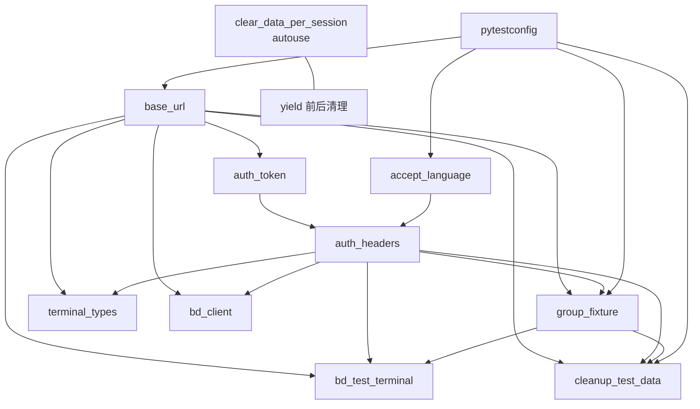

# jkpt — conftest.py Fixture 与 Hook 适配文档

> **适配层文档（仅 jkpt_api_test 项目）**。其他项目复用本仓库技能时，**不要**直接复制此文档；按相同结构自建 `conftest-<your-project>.md`。
>
> 通用规范见：[../SKILL.md](../SKILL.md)、[methods-reference.md](methods-reference.md)、[yaml-conventions.md](yaml-conventions.md)。

源代码：[../../../conftest.py](../../../conftest.py)

---

## 1. 总览

| 类别 | 名称 |
|------|------|
| **配置 hook** | `pytest_configure` |
| **基础 fixture** | `base_url`、`accept_language` |
| **认证** | `generate_captcha_id`、`auth_token`、`auth_headers` |
| **失败上下文 hook** | `pytest_runtest_makereport` |
| **业务前置** | `group_fixture`、`terminal_types`、`bd_test_terminal`、`bd_client` |
| **会话清理** | `clear_data_per_session`（autouse）、`cleanup_test_data`（autouse） |
| **内部辅助函数（用例勿调）** | `get_terminals_by_group`、`cleanup_terminals_batch`、`delete_groups_in_order` |

### 全局常量与环境

| 项 | 取值 / 说明 |
|----|------------|
| `base_url` | `http://back.tdwtv2.pg8.ink`（写在 `pytest_configure`，可由命令行覆写于未来扩展） |
| `accept_language` | `zh-CN` |
| `BD_TEST_ADDR` | `20260430200104`（BD 协议测试设备 SN，固定值） |
| `ENABLE_AUTO_CLEANUP` | 环境变量，默认 `true`；设为 `false` 可跳过 session 末清理 |
| 全局 `http` | `BaseRequest()` 单实例，供本 conftest 内部直接调用（用例不要复用） |
| 全局 `ocr` | `CaptchaRecognizer()` 单实例 |

---

## 2. Fixture 依赖图



---

## 3. Fixture 速查表

| Fixture | 作用域 | 依赖 | 返回类型 | 何时注入 |
|---------|--------|------|---------|---------|
| `base_url` | session | `pytestconfig` | `str` | 任何用例 |
| `accept_language` | session | `pytestconfig` | `str` | 需自定义语言头时 |
| `auth_token` | session | `base_url` | `str` | 一般不直接注入，通过 `auth_headers` 使用 |
| `auth_headers` | session | `auth_token`, `accept_language` | `dict` | **绝大多数用例必注入** |
| `group_fixture` | session | `base_url`, `auth_headers`, `pytestconfig` | `dict` | 需要分组上下文（`one_id` / `two_id` / `three_id`） |
| `terminal_types` | session | `base_url`, `auth_headers` | `list[dict]` | 需枚举设备类型 |
| `bd_test_terminal` | session | `base_url`, `auth_headers`, `group_fixture` | `str`（addr） | 北斗协议测试用例 |
| `bd_client` | session | `base_url`, `auth_headers` | `BDProtocolClient` | 协议发送场景 |
| `clear_data_per_session` | session autouse | — | None | 自动；用例无需感知 |
| `cleanup_test_data` | session autouse | `base_url`, `auth_headers`, `group_fixture`, `pytestconfig` | None | 自动；session 结束清理 |

---

## 4. Fixture 详解

### 4.1 `base_url(pytestconfig) -> str`

返回 `pytestconfig.base_url`，由 `pytest_configure` 写入。

```python
def test_xxx(self, base_url, auth_headers):
    url = f"{base_url}/api/monitor/xxx"
```

### 4.2 `accept_language(pytestconfig) -> str`

返回 `zh-CN`。`auth_headers` 中已合并，单独注入仅用于自定义场景。

### 4.3 `generate_captcha_id() -> str`

**不是 fixture，是模块函数**。生成 18 位 `captchaId`（毫秒时间戳 + 5 位随机数）。

```python
captcha_id = generate_captcha_id()   # 例：174609850933812345
```

### 4.4 `auth_token(base_url) -> str`

验证码识别 + 登录获取 token，**最多重试 5 次**。失败 `pytest.fail`。

- 登录路径：`/api/monitor/web-user/login`
- 凭据：`account="tmn"`, `password="4f9cb165cd6249312e5804fcf9416c5e"`（密码已 MD5）
- 验证码识别：`CaptchaRecognizer.recognize_from_response`
- 重试间隔：1 秒

用例**通常不直接注入** `auth_token`；使用 `auth_headers` 即可。

### 4.5 `auth_headers(auth_token, accept_language) -> dict`

```python
{
    "Authorization": f"{auth_token}",          # 注意：不带 "Bearer " 前缀
    "Accept-Language": "zh-CN"
}
```

**用例典型用法**：

```python
def test_xxx(self, base_url, auth_headers, case):
    headers = {**auth_headers}
    if case.get("no_auth"):
        headers = {k: v for k, v in headers.items() if k.lower() != "authorization"}
    res = BaseRequest().send_request(method="get", url=..., headers=headers, ...)
```

### 4.6 `pytest_runtest_makereport(item, call)` — Hook

`call` 阶段失败时，从 `get_last_http_context()` 自动附加 Allure：

| Allure 附件 | 内容 |
|------------|------|
| `【失败】请求信息` | 最近一次请求的 method/url/headers/params/body（已脱敏） |
| `【失败】响应信息` | 最近一次响应的 status_code / body |
| `【失败】错误信息` | 异常堆栈（若有） |
| `【失败】断言详情` | `report.longrepr.reprcrash.message` |

**无需在用例显式调用**。

### 4.7 `group_fixture(base_url, auth_headers, pytestconfig) -> dict`

按 `L1 → L2 → L3` 顺序创建三级测试分组，返回 ID 字典：

```python
{
    "one_id":   <一级分组ID>,
    "two_id":   <二级分组ID>,
    "three_id": <三级分组ID>,
}
```

分组名带 8 位毫秒时间戳后缀（如 `L1_98765432`）保证唯一。session 末由 `cleanup_test_data` 删除。

**典型用法**（与 `extract.yaml` 占位符并存，二选一）：

```python
def test_xxx(self, base_url, auth_headers, group_fixture, case):
    gid = case.get("groupId")
    if "{{three_id}}" in str(gid):
        group_id = group_fixture["three_id"]
    else:
        group_id = gid
```

### 4.8 `terminal_types(base_url, auth_headers) -> list[dict]`

调用 `GET /api/monitor/enums/terminal-types`，返回 `[{"name": "...", "value": "..."}, ...]`。失败返回 `[]`。

### 4.9 `bd_test_terminal(base_url, auth_headers, group_fixture) -> str`

在 `group_fixture["one_id"]` 下创建一台 BD 协议测试设备（SN 固定为 `BD_TEST_ADDR`），返回 `addr` 字符串。

设备属性（固定）：

```python
{
    "addr": "20260430200104",
    "terminalType": "PD18",
    "useScope": "STEAMER",
    "trackColor": "#141323",
    "trackSize": 5,
    "remark": "bd协议测试",
    ...
}
```

**重要**：创建失败（如已存在）**不阻塞测试**，仍返回固定 `addr` 复用。session 末由 `cleanup_test_data` 删除。

### 4.10 `bd_client(base_url, auth_headers) -> BDProtocolClient`

构造北斗协议客户端实例：

```python
transport = BDProtocolTransport(base_url=base_url, headers=auth_headers, http=http)
return BDProtocolClient(transport=transport)
```

**典型协议用例**：

```python
def test_protocol_alarm(self, bd_client, bd_test_terminal):
    result = bd_client.send_alarm_13(from_addr=bd_test_terminal)
    assert result.success, f"协议发送失败: code={result.code}, msg={result.msg}"
```

### 4.11 `clear_data_per_session()` — session autouse

仅做两件事：

1. `yield` 之前：`clear_yaml()` 清空 `./extract.yaml`
2. `yield` 之后：打印结束分隔线

### 4.12 `cleanup_test_data(...)` — session autouse

`yield` 之后执行；通过 `ENABLE_AUTO_CLEANUP=false` 跳过。

清理顺序：

1. **删设备**：`get_terminals_by_group` → `cleanup_terminals_batch`，按 `three_id → two_id → one_id`
2. **删分组**：`delete_groups_in_order`，按 `three_id → two_id → one_id`

`group_fixture` 返回的字典通过 `pytestconfig.stash["test_group_ids"]` 持久化，防止 fixture 失效。

---

## 5. 内部辅助函数（用例**勿直接调用**）

这些是 conftest 内部清理逻辑，**不是 fixture**，**不在 `common/`**，禁止在 testcase import：

| 函数 | 用途 |
|------|------|
| `get_terminals_by_group(base_url, auth_headers, group_id)` | 取分组下所有设备 addr |
| `cleanup_terminals_batch(base_url, auth_headers, group_id, addrs)` | 批量删除设备 |
| `delete_groups_in_order(base_url, auth_headers, group_ids)` | 倒序删除三级分组 |

若 testcase 确需类似能力，请抽到 `common/`（按 [CONTRIBUTING.md](../CONTRIBUTING.md) 流程）。

---

## 6. 用例集成清单（生成时对照）

写新 testcase 时按本清单核对 fixture 注入：

- [ ] HTTP 用例最小注入：`base_url`、`auth_headers`、`case`
- [ ] 需分组上下文：追加 `group_fixture`
- [ ] 需设备枚举：追加 `terminal_types`
- [ ] BD 协议用例：注入 `bd_client` + `bd_test_terminal`（**不再注入** `auth_headers`，transport 已剥离 Authorization）
- [ ] `no_auth` 场景：在方法体内 strip `Authorization`，**不要**写第二个 `headers_no_auth` fixture
- [ ] 不要在 `conftest.py` 写 `extract.yaml`；同文件链路用 `write_yaml` + `_resolve_value`

---

## 7. 与 SKILL 模式映射

| jkpt 场景 | 用 SKILL 模式 | 关键 fixture |
|----------|--------------|-------------|
| 登录、列表、查询（无状态） | 模式 A | `base_url`, `auth_headers` |
| 分组 / 终端增删改查 | 模式 B / B′ | + `group_fixture` |
| BD 协议发送 | 模式 A（短）/ 模式 B′（链路） | `bd_client`, `bd_test_terminal` |

更多 YAML 字段命名见 [yaml-conventions.md](yaml-conventions.md)。
