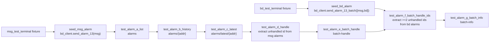

## 范围（7 个接口，全部覆盖）

| # | 方法 | 路径 | YAML 顶层 key | Python 测试方法 |
|---|---|---|---|---|
| 1 | GET | `/api/monitor/alarms` | `alarm_list_cases` | `test_alarm_a_list` |
| 2 | GET | `/api/monitor/alarms/{addr}` | `alarm_history_cases` | `test_alarm_b_history` |
| 3 | GET | `/api/monitor/alarms/latest/{addr}` | `alarm_latest_cases` | `test_alarm_c_latest` |
| 4 | PUT | `/api/monitor/alarms/{id}` | `alarm_handle_cases` | `test_alarm_d_handle` |
| 5 | PUT | `/api/monitor/alarms/batch-handle` | `alarm_batch_handle_cases` | `test_alarm_e_batch_handle` |
| 6 | PUT | `/api/monitor/alarms/batch-handle/ids` | `alarm_batch_handle_ids_cases` | `test_alarm_f_batch_handle_ids` |
| 7 | GET | `/api/monitor/alarms/batch-info` | `alarm_batch_info_cases` | `test_alarm_g_batch_info` |

## 待新增 / 修改文件

- 新增 `jkpt_api_test/testcases/test_alarm_controller.py`
- 新增 `jkpt_api_test/yaml/test_alarm_controller.yaml`
- 复用 `jkpt_api_test/conftest.py` 既有 fixture（`msg_test_terminal`、`bd_test_terminal`、`bd_client`），不在 conftest 写 extract.yaml

## 数据链路



关键约定：

- **设备地址来源**：`msg_test_terminal`、`bd_test_terminal` 来自 `conftest.py` fixture。
- **不互调测试方法**：禁止在测试中调用 `test_send_alarm_13_batch_two_terminals` 等 `test_*` 方法；统一通过 `bd_client.send_*` 或 helper 造数。
- **报警数据准备**：消费型用例执行前就地造数，不只依赖全局一次 seed。
- **分设备隔离**：`alarms/{id}` 仅使用 `msg_test_terminal` 报警；`batch-handle/ids` 仅使用 `bd_test_terminal` 报警。
- **处理报警字段**：`handle_result`（兼容旧 `handleResult`）。
- pytest 方法名保持先 seed、后接口主链路的顺序执行。

## 参数传递规范（按 api-test-framework 技能）

### 通道A：Fixture 注入（会话级前置数据）

- 来源：`conftest.py` fixture。
- 本计划使用：
  - `msg_test_terminal`：单条处理链路的设备地址。
  - `bd_test_terminal`：批量按 ID 处理链路的设备地址。
  - `bd_client`：协议造数入口（`send_alarm_13` / `send_alarm_13_batch`）。
- 规则：fixture 只在测试方法参数注入，不在 YAML 中硬编码真实设备号。

### 通道B：extract.yaml（同文件链路动态变量）

- 来源：同文件上游接口响应提取后写入。
- 写入方式：`write_yaml("./extract.yaml", {"alarm_single_id": <id>, "alarm_batch_ids": <ids>}, mode="append")`
- 读取方式：`read_yaml("./extract.yaml")` 或 `_resolve_value("{{alarm_single_id}}", required=True)`。
- 规则：**不在 conftest.py 写 extract.yaml**，仅在 testcase 内写入与消费（符合技能规范）。

### 本文件参数映射（避免执行偏移）

- `alarms/{id}`：
  - `addr` 走 fixture：`msg_test_terminal`
  - `id` 走 extract：`alarm_single_id`（来自 `GET /api/monitor/alarms?addr=msg_test_terminal` 提取）
- `alarms/batch-handle/ids`：
  - `addr` 走 fixture：`bd_test_terminal`
  - `ids` 走 extract：`alarm_batch_ids`（来自 `GET /api/monitor/alarms?addr=bd_test_terminal` 提取，目标>=2）
- 负向空列表：
  - `ids` 直接来自 YAML：`[]`（不走 extract）

## 参数传递链路（明确版）

### alarms/{id}（单个处理）的 id 获取链路

1. 在 `test_alarm_d_handle` 正向执行前，调用 helper（底层 `bd_client.send_alarm_13(from_addr=msg_test_terminal)`）模拟报警。
2. 调用 `GET /api/monitor/alarms`，传 `addr=msg_test_terminal` 查询该设备报警。
3. 从返回中提取“未处理”报警第一条 `id`（候选路径按顺序匹配：`$.data.items[*]`、`$.data.records[*]`，再取元素 `id`）。
4. 将该 `id` 作为 `PUT /api/monitor/alarms/{id}` 的 path 参数执行处理。
   - 同步写入：`write_yaml("./extract.yaml", {"alarm_single_id": id}, mode="append")`。
5. 若未提取到 `id`：先短轮询 3 次（每次 0.5~1 秒）重查；仍无则补造一次并重查；最终无 `id` 直接 `pytest.fail`。

### alarms/batch-handle/ids（批量处理）的 ids 获取链路

1. 在 `test_alarm_f_batch_handle_ids` 正向执行前，通过 helper 造数：优先 `bd_client.send_alarm_13_batch(from_addrs=[msg_test_terminal, bd_test_terminal])`，必要时追加 `send_alarm_13(from_addr=bd_test_terminal)`。
2. 调用 `GET /api/monitor/alarms`，传 `addr=bd_test_terminal` 查询该设备报警。
3. 动态提取“未处理” `ids`（目标至少 2 条）后调用 `PUT /api/monitor/alarms/batch-handle/ids`。
   - 同步写入：`write_yaml("./extract.yaml", {"alarm_batch_ids": ids[:2]}, mode="append")`。
4. 若不足 2 条：短轮询后重查，仍不足则补造并重提；最终不足 2 条直接失败。

## 接口详情

### alarms（分页查询所有设备的报警信息）

- 请求方式：`GET`，参数在 URL query string
- 参数：`addr`（可选）、`alarm_type`（可选）、`page`、`page_size`
- 正向：带有效 addr
- 负向：addr 为空、缺 token（`no_auth: true`）

### alarms/{addr}（分页查询设备历史报警信息）

- 请求方式：`GET`，`addr` 在 path
- 参数：`page`、`page_size`
- 正向：有效 addr
- 负向：addr 为空

### alarms/latest/{addr}（获取最新一条报警）

- 请求方式：`GET`，`addr` 在 path
- 正向：有效 addr 有报警记录
- 负向：addr 为空或无报警

### alarms/{id}（处理报警）

- 请求方式：`PUT`，`id` 在 path
- 参数：`handle_result`（最多 300 字）
- 正向：先 `bd_client.send_alarm_13(msg_test_terminal)` 造数，再 `GET /api/monitor/alarms?addr=msg_test_terminal` 提取“未处理”首个 `id`，传入 path
- 负向：无效 ID

### batch-handle（按类型批量报警处理）

- 请求方式：`PUT`，Body: `AlarmBatchHandleReqDto`
- 参数：`alarm_type`
- 正向：有效 alarm_type 且存在未处理报警
- 负向：空类型、空 body

### batch-handle/ids（按 ID 批量处理报警）

- 请求方式：`PUT`，Body: `AlarmBatchHandleByIdReqDto`
- 参数：`ids`（报警 ID 列表）
- 正向：先 `bd_client.send_alarm_13_batch([msg_test_terminal, bd_test_terminal])` 造数，再查询 `bd_test_terminal` 报警并提取“未处理” `ids`（目标 2 条）后调用批量处理；不足则轮询+补造+重提取
- 负向：空列表

### batch-info（获取报警类型及设备数量）

- 请求方式：`GET`
- 正向：正常调用
- 负向：缺 token

## YAML 结构示例

```yaml
alarm_list_cases:
  - name: "分页查询报警列表-正向"
    scenario: "positive"
    addr: "{{msg_test_terminal}}"
    page: 1
    page_size: 10
    expected:
      code: 0
      msg: "成功"

alarm_batch_handle_ids_cases:
  - name: "按ID批量处理-正向"
    scenario: "positive"
    ids: []
    expected:
      code: 0
      msg: "成功"
  - name: "按ID批量处理-负向-空列表"
    scenario: "empty_ids"
    ids: []
    expected:
      code: 999
      error_msg: "失败"
```

> 负向 `code`/`msg` 以服务实际返回为准；若不一致，跑通后改 YAML。

## 用例数预估（每接口 1 正 + 1~2 负向）

- list: 1 正 + 2 负（addr 为空、缺 token）
- history: 1 正 + 1 负（addr 为空）
- latest: 1 正 + 1 负（addr 不存在）
- handle: 1 正 + 1 负（ID 不存在）
- batch-handle: 1 正 + 1 负（type 为空）
- batch-handle/ids: 1 正 + 1 负（空列表）
- batch-info: 1 正 + 1 负（缺 token）
- **合计约 14 用例 + 1 前置 seed 步骤**

## Apifox 数据来源（已验证）

通过 `read_project_oas_it1ai0` + `read_project_oas_ref_resources_it1ai0` 读取：

- Tag: `报警管理接口`
- `GET /api/monitor/alarms` → `/paths/_api_monitor_alarms.json`
- `GET /api/monitor/alarms/{addr}` → `/paths/_api_monitor_alarms_{addr}.json`
- `GET /api/monitor/alarms/latest/{addr}` → `/paths/_api_monitor_alarms_latest_{addr}.json`
- `PUT /api/monitor/alarms/{id}` → `/paths/_api_monitor_alarms_{id}.json`
- `PUT /api/monitor/alarms/batch-handle` → `/paths/_api_monitor_alarms_batch-handle.json`
- `PUT /api/monitor/alarms/batch-handle/ids` → `/paths/_api_monitor_alarms_batch-handle_ids.json`
- `GET /api/monitor/alarms/batch-info` → `/paths/_api_monitor_alarms_batch-info.json`
