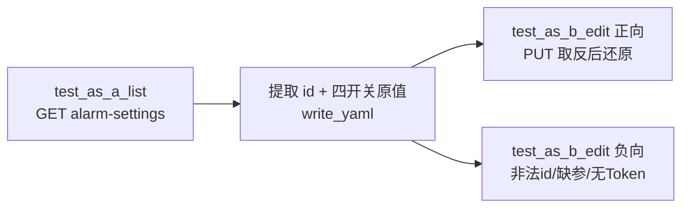

## 1. 接口范围（Apifox tag 锁定）

来源：Apifox 项目「Swagger3接口文档」→ tag **`报警通知设置管理接口`**（仅 2 条，不含「离线报警设置接口」「消息通知设置」等相邻模块）。

| # | 方法 | Path | 概要 | OperationId |
|---|------|------|------|-------------|
| 1 | GET | `/api/monitor/alarm-settings` | 获取报警通知设置列表 | `listAlarmSettingsUsingGET` |
| 2 | PUT | `/api/monitor/alarm-settings/{id}` | 编辑报警通知设置 | `editAlarmSettingsUsingPUT` |

**Swagger 请求形态（实施必读）**

- 列表：无业务 query，仅文档标注 `Authorization` query 必填（与现有 monitor 用例一致：**优先 Header `auth_headers`**，鉴权失败再补 query）。
- 编辑：**全部走 query params**（非 JSON body）：
  - path：`id`（string）
  - query 必填 boolean：`alarmVoice`、`emailNoti`、`popupWindow`、`smsNoti`

**响应结构（Apifox schema）**

- 列表：`CommonResult«List«AlarmSettingRespDto»»` → `$.data` 为数组
- 单项 `AlarmSettingRespDto` 字段：
  - `id` — 设置记录 ID
  - `alarmType` — `NameValueHolder`（`name` 枚举名、`value` 中文说明）
  - `alarmVoice` / `emailNoti` / `popupWindow` / `smsNoti` — 四个开关（文档类型为 object，实跑按 boolean 解析，联调时以抓包为准）



---

## 2. 待新增 / 修改文件清单

| 动作 | 路径 | 说明 |
|------|------|------|
| **本文档** | [jkpt_api_test/plan/alarm-settings-controller-tests.plan.md](jkpt_api_test/plan/alarm-settings-controller-tests.plan.md) | 计划文档（符合 plan-path 规范） |
| **新增** | [jkpt_api_test/yaml/test_alarm_settings_controller.yaml](jkpt_api_test/yaml/test_alarm_settings_controller.yaml) | 全部场景数据 |
| **新增** | [jkpt_api_test/testcases/test_alarm_settings_controller.py](jkpt_api_test/testcases/test_alarm_settings_controller.py) | 参数化执行 + extract 写入 |
| **不改** | [jkpt_api_test/conftest.py](jkpt_api_test/conftest.py) | 复用 `base_url`、`auth_headers`、`clear_data_per_session` |

参考实现风格：[test_field_template_controller.py](jkpt_api_test/testcases/test_field_template_controller.py) + [field-template-controller-tests.plan.md](jkpt_api_test/plan/field-template-controller-tests.plan.md)。

---

## 3. 测试模式与数据链路（api-test-framework 模式 B′）

### 通道划分

| 通道 | 用途 | 本模块 |
|------|------|--------|
| **Fixture** | 会话级鉴权 | `base_url`、`auth_headers` |
| **extract.yaml** | 同文件动态变量 | `alarm_setting_id` + `alarm_setting_original`（四开关快照） |
| **禁止** | — | conftest 写 extract；互调 `test_*` 造数；协议层 `bd_client`（本模块无造数需求） |

### 变量写入时机（`test_as_a_list` 正向）

列表 `code == 0` 且 `$.data` 非空时：

1. 取 **第一条** 记录（推荐默认；若环境 alarmType 不稳定，联调后可改为按 `alarmType.name` 过滤，见 §7 待确认项）
2. 写入 extract：
   - `alarm_setting_id` ← `$.data[0].id`
   - `alarm_setting_original` ← `{alarmVoice, emailNoti, popupWindow, smsNoti}` 四个布尔原值

读取：`_resolve_value("{{alarm_setting_id}}", required=True)`；原值从 extract 或列表响应内存变量读取。

### 编辑正向策略（默认：快照 + 还原）

用户未确认时的**推荐默认**（grill-me 推荐项）：

1. 编辑前读取四开关原值 `orig`
2. `PUT` 传 **取反值** `not orig`（确保确实发生变更）
3. 断言 `code == 0`；可选二次 `GET` 列表校验对应 `id` 的四字段已变更
4. **立即再 `PUT` 一次传 `orig` 还原**，避免污染环境
5. 还原失败 → `pytest.fail`（比静默污染更可观测）

### pytest 收集顺序

方法前缀保证字典序：`test_as_a_*` → `test_as_b_*`

- `test_as_a_list_alarm_settings` — 列表
- `test_as_b_edit_alarm_settings` — 编辑（parametrize 含正向+负向）

---

## 4. YAML 用例清单（顶层 key + 场景）

### `list_alarm_settings_cases`（2 条）

| name | 要点 | expected（初稿，负向非 3001 需联调回填） |
|------|------|------------------------------------------|
| 报警通知设置-列表-正向 | 默认鉴权 | `code: 0`，`msg: "成功"`；可附加「`$.data` 为 list 且 length>=1」 |
| 报警通知设置-列表-负向-无Token | `no_auth: true` | `code: 3001`，`error_msg: "没有访问权限"`（对齐字段模板模块） |

### `edit_alarm_settings_cases`（5 条）

| name | 要点 | expected |
|------|------|----------|
| 报警通知设置-编辑-正向 | `settingId: "{{alarm_setting_id}}"`；代码内取反四开关 + 还原 | `code: 0`，`msg: "成功"` |
| 报警通知设置-编辑-负向-非法id | `settingId: "000000000000000000000000"` | `code: 999`，`error_msg: "失败"`（TODO 联调） |
| 报警通知设置-编辑-负向-缺alarmVoice | `omit_alarm_voice: true` | `code: 1001` + 具体 msg（TODO 联调） |
| 报警通知设置-编辑-负向-缺emailNoti | `omit_email_noti: true` | 同上 TODO |
| 报警通知设置-编辑-负向-无Token | `no_auth: true` | `code: 3001` |

YAML 字段命名（snake_case，与现有模块一致）：

```yaml
edit_alarm_settings_cases:
  - name: "报警通知设置-编辑-正向"
    setting_id: "{{alarm_setting_id}}"
    expected:
      code: 0
      msg: "成功"
```

Python 侧兼容 `settingId` / `setting_id`；四开关由代码根据 `alarm_setting_original` 计算，**不在 YAML 写死 true/false**（避免与环境初始状态耦合）。

---

## 5. Python 实现要点

```python
# 结构骨架（与 field-template 对齐）
class TestAlarmSettingsController:
    test_data = read_yaml("./yaml/test_alarm_settings_controller.yaml")
```

| 要点 | 说明 |
|------|------|
| HTTP | `BaseRequest().send_request(..., log_level="none")` |
| 列表 GET | `GET {base_url}/api/monitor/alarm-settings`，headers=`auth_headers` |
| 编辑 PUT | `PUT {base_url}/api/monitor/alarm-settings/{id}`，`params={alarmVoice, emailNoti, popupWindow, smsNoti}` |
| Boolean query | `requests` 传 Python `bool`；若网关要求字符串再改为 `str(v).lower()`（联调确认） |
| 缺参负向 | `omit_*` 标志控制不放入 `params` 的 key（仿 `omit_fields_query`） |
| 断言 | `_assert_and_report` + `assert_api_result`（[allure_assert_util.py](jkpt_api_test/common/allure_assert_util.py)） |
| extract 缺失 | `test_as_b` 若缺 `alarm_setting_id` → `pytest.skip`（单跑 `-k test_as_b` 时预期） |
| JSONPath | `id` 默认 `$.data[0].id`；列表为空 `pytest.fail("报警通知设置列表为空，无法继续编辑链路")` |

---

## 6. 联调回填清单（实施第一步）

对接环境各跑 1 次抽样，回填 YAML `expected`：

1. 列表正向：`$.data` 路径、是否恒为非空数组
2. 编辑正向：四开关响应字段真实类型（bool / 0|1 / 字符串）
3. 负向非法 id、缺必填 boolean 的真实 `code`/`msg`
4. 鉴权：仅 Header 是否足够（与字段模板结论一致则不改）

---

## 7. 待确认项（grill-me 遗留，不阻塞计划）

用户跳过问答后采用的**默认决策**：

| 决策点 | 默认 |
|--------|------|
| 编辑后是否还原 | **是**（快照 → 取反断言 → 还原） |
| 编辑哪一条记录 | **列表第一条** `$.data[0]` |
| 是否覆盖离线报警设置 | **否**（另模块 `offline-alarm-settings`） |

若后续要改为「按 `alarmType.name` 指定某类报警」或「只测列表不写编辑正向」，仅需改 `test_as_a_list` 提取逻辑与 YAML 场景数。

---

## 8. 验证命令

```bash
cd jkpt_api_test
pytest testcases/test_alarm_settings_controller.py -v
# 完整链路（含 extract 依赖）
pytest testcases/test_alarm_settings_controller.py
# 仅列表
pytest testcases/test_alarm_settings_controller.py -k test_as_a
```

**通过标准**：全文件 7 条 parametrize 用例通过；编辑正向执行后环境四开关与跑前一致（还原成功）。
