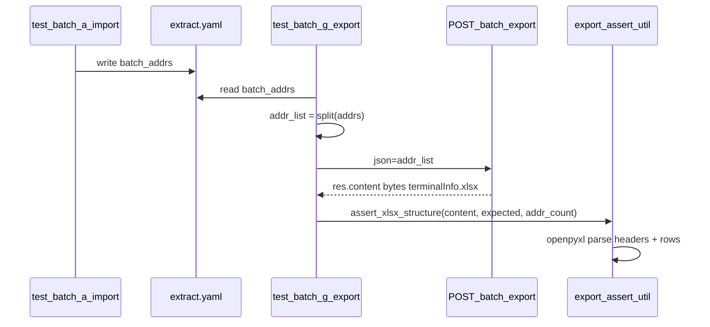

# 批量导出设备信息 — 方案 B（xlsx 表结构断言）详细计划

> 范围：**仅** [`test_batch_g_export`](jkpt_api_test/testcases/test_batch_terminal_controller.py) 中 **正向用例** `批量导出设备-正向`（`batch_export_cases[0]`）。负向 `addrs 为空` 仍走 JSON 分支，本计划不改动。

---

## 1. 背景与目标

### 1.1 当前行为

[`_assert_export_response`](jkpt_api_test/testcases/test_batch_terminal_controller.py)（315–344 行）对二进制响应仅断言：

- HTTP 200
- `len(res.content) > 0`

控制台/Allure 里 body 显示乱码是 **正常现象**：响应是 `terminalInfo.xlsx`（ZIP/OOXML，`PK` 魔数），不是文本。

### 1.2 目标（方案 B）

在 **不引入 golden 文件哈希、不交叉调用 details API（方案 C）** 的前提下：

1. 确认响应是可解析的 xlsx
2. 校验 **首行表头** 与预期一致
3. 校验 **数据行数** ≥ 请求导出的设备数量

### 1.3 正向用例数据流



---

## 2. 接口与响应契约（已核实）

| 项 | 值 |
|----|-----|
| 方法/路径 | `POST /api/monitor/terminals/batch/export` |
| 请求体 | **字符串数组** `["20260428001", "20260428002", ...]`（非 `{addrs:...}` 对象） |
| 必需 Header | `Time-Zone: Asia/Shanghai`、`time-zone-utc: +08:00`（现有代码已有） |
| 成功响应 Header | `Content-Disposition: attachment;filename=terminalInfo.xlsx` |
| Content-Type | `application/vnd.ms-excel;charset=utf-8` |
| 成功响应 Body | 二进制 xlsx，`content[:2] == b"PK"` |

失败时（如 `addrs` 为空）部分环境仍返回 **HTTP 200 + xlsx 空表** 或 **JSON `{code,msg}`**；正向用例只处理 **非 JSON 前缀** 的成功下载路径。

---

## 3. 表头来源（导出 terminalInfo.xlsx，已确认）

**注意：导出表头与导入模板无关。**  
导入模板 [`import-device-template2026_5_1.xlsx`](jkpt_api_test/yaml/import-device-template2026_5_1.xlsx) 仅用于 `batch/import`，**不得**作为 `batch/export` 断言依据。

导出接口返回的 `terminalInfo.xlsx` 表头（用户截图确认，共 **9 列**）：

| 列 | 表头 | 示例值（第 2 行） |
|----|------|-------------------|
| A | 状态 | 离线 |
| B | 设备卡号 | 66006611 |
| C | 备注名称 | /一级/设计 |
| D | 设备类型 | 无源控制器 |
| E | 最后通信时间 | 2026-05-08 15:53:43 |
| F | 最后离线时间 | 2026-05-08 15:53:42 |
| G | 设备分组 | 智慧园区 |
| H | 运行状态信息 | （可为空） |
| I | 自定义字段 | Template L1:20260428001 Template L2:20260428001 |

**关键列映射（断言用）**：

- 设备唯一标识列 → **`设备卡号`**（对应请求体 `addr_list` 中的 addr，**不是**导入模板的「设备SN」）
- 行数基准列 → **`设备卡号`** 非空行数 ≥ `len(addr_list)`

表头直接写入 YAML `expected.headers`（推荐内联，不另建 fixture 文件）。

---

## 4. 新增公共模块设计

### 4.1 文件

[`common/export_assert_util.py`](jkpt_api_test/common/export_assert_util.py)（新建）

### 4.2 核心 API

```python
from dataclasses import dataclass
from io import BytesIO
from typing import Any

@dataclass
class XlsxSheetSnapshot:
    sheet_name: str
    headers: list[str]
    data_row_count: int          # 不含表头，跳过全空行
    first_data_row: tuple[Any, ...] | None

def parse_xlsx(content: bytes) -> XlsxSheetSnapshot:
    """BytesIO + openpyxl read_only；取 active sheet 首行作 headers。"""

def assert_xlsx_export_structure(
    *,
    case_name: str,
    content: bytes,
    expected: dict,
    addr_count: int | None = None,
) -> XlsxSheetSnapshot:
    """
    方案 B 断言入口。expected 字段见 §5。
    失败时抛出 AssertionError，消息含 case_name / 预期 vs 实际。
    """
```

### 4.3 断言分层（方案 B 内部仍保留轻量 Layer A）

| 顺序 | 检查 | 失败信息示例 |
|------|------|--------------|
| 1 | `len(content) >= 512` | 导出正文过小 |
| 2 | `content[:2] == b"PK"` | 非 xlsx/zip 魔数 |
| 3 | `openpyxl.load_workbook` 不抛异常 | xlsx 结构损坏 |
| 4 | `headers == expected["headers"]` | 表头不匹配（逐项 diff） |
| 5 | `data_row_count >= min_rows` | 数据行不足 |

**min_rows 计算规则**（正向用例）：

- YAML 显式配置 `expected.min_rows` 时优先使用
- 否则若传入 `addr_count=len(addr_list)`，则 `min_rows = addr_count`
- 允许 `data_row_count > min_rows`（服务端可能带汇总行；若出现再收紧）

**可选轻量 Header 检查**（不属方案 C）：

- `expected.filename`：从 `Content-Disposition` 解析，默认 `terminalInfo.xlsx`
- `expected.addr_column: "设备卡号"`：在表头中找列索引，断言该列非空单元格数 ≥ `min_rows`（**不**校验具体 addr 值，避免滑向方案 C）

### 4.4 日志 / Allure

- 复用 [`logger_util`](jkpt_api_test/common/logger_util.py) 的 `sep` / `key` 输出：`headers`、`data_row_count`、`sheet_name`
- 可选：`allure.attach(content, name="terminalInfo.xlsx", attachment_type=...)` 便于人工复核（实施时若项目已有 allure 常量则沿用）

---

## 5. YAML 变更（正向用例）

文件：[`yaml/test_batch_terminal_controller.yaml`](jkpt_api_test/yaml/test_batch_terminal_controller.yaml)

**变更前**（118–123 行）：

```yaml
- name: "批量导出设备-正向"
  addrs: "{{batch_addrs}}"
  binary_response: true
  expected:
    http_status: 200
```

**变更后**（导出表头，§3 已确认）：

```yaml
- name: "批量导出设备-正向"
  addrs: "{{batch_addrs}}"
  binary_response: true
  expected:
    http_status: 200
    filename: terminalInfo.xlsx
    headers:
      - "状态"
      - "设备卡号"
      - "备注名称"
      - "设备类型"
      - "最后通信时间"
      - "最后离线时间"
      - "设备分组"
      - "运行状态信息"
      - "自定义字段"
    addr_column: "设备卡号"   # 对应 addr_list；断言该列非空行数
    # min_rows 不写则运行时 = len(addr_list)
```

负向用例 **不改**：

```yaml
- name: "批量导出设备-负向-addrs为空"
  addrs: ""
  expected:
    code: 999
    error_msg: "失败"
```

---

## 6. 测试代码变更

### 6.1 `test_batch_g_export`（225–249 行）

仅增加一行：把 `addr_list` 传给断言。

```python
print_response(res)
self._assert_export_response(case, res, addr_list=addr_list)
```

### 6.2 `_assert_export_response` 改造

```python
def _assert_export_response(self, case, res, addr_list=None):
    # ... 现有 JSON 分支不变 ...

    # 现有 HTTP + 非空断言保留
    assert res.status_code == expected_http
    assert len(body) > 0

    # 方案 B：仅 binary_response 且 expected 含 headers 时解析 xlsx
    exp = case["expected"]
    if case.get("binary_response") and exp.get("headers"):
        from common.export_assert_util import assert_xlsx_export_structure
        snap = assert_xlsx_export_structure(
            case_name=case["name"],
            content=body,
            expected=exp,
            addr_count=len(addr_list) if addr_list else None,
            content_disposition=res.headers.get("Content-Disposition"),
        )
        key("解析表头", snap.headers)
        key("数据行数", snap.data_row_count)
```

**设计要点**：

- `binary_response: true` 但 **无 `headers`** → 保持旧行为（仅 HTTP+非空），便于 location export 渐进迁移
- 负向无 `binary_response` → 不进入 xlsx 分支

### 6.3 依赖

[`pyproject.toml`](jkpt_api_test/pyproject.toml)：

```toml
dependencies = [
    ...
    "openpyxl>=3.1.0",
]
```

---

## 7. 实施步骤（按序）

| 步骤 | 动作 | 产出 |
|------|------|------|
| ~~0~~ | ~~采集表头~~ | **已完成**（用户截图 §3，导出 9 列） |
| 1 | `pip install openpyxl`，更新 `pyproject.toml` | 依赖就绪 |
| 2 | 实现 `common/export_assert_util.py` + 单元自测 | 公共断言 |
| 3 | 更新 YAML `expected.headers`（§5 导出 9 列） | 配置契约 |
| 4 | 改 `_assert_export_response` / `test_batch_g_export` | 用例接入 |
| 5 | 全量跑 `test_batch_g_export` | case0 通过；case1 仍 JSON 断言 |
| 6 | 更新 `methods-reference.md` + `CHANGELOG.md`（公共 util 提取规则） | 文档 |

---

## 8. 验收标准

**正向 `批量导出设备-正向`**

- [ ] HTTP 200
- [ ] `Content-Disposition` 含 `terminalInfo.xlsx`（若配置了 `expected.filename`）
- [ ] `res.content` 可被 openpyxl 打开
- [ ] 首行表头与 YAML `expected.headers` 完全一致（顺序+文案）
- [ ] 数据行数 ≥ `len(addr_list)`（来自 `{{batch_addrs}}`）
- [ ] （可选）`设备卡号` 列至少 `min_rows` 个非空单元格
- [ ] Allure/控制台输出解析后的表头与行数，**不**打印原始 binary

**负向 `批量导出设备-负向-addrs为空`**

- [ ] 行为与改造前一致（JSON 则 `assert_api_result`；若环境返回 xlsx 则另开 issue，本计划不处理）

---

## 9. 风险与应对

| 风险 | 应对 |
|------|------|
| 误用导入模板表头 | 仅使用 §3 导出 9 列；导入/导出 schema 独立 |
| 服务端列顺序/列名变更 | 用例失败即契约回归信号；更新 YAML headers |
| `batch_addrs` 为空导致 skip | 正向依赖 import，已有 `pytest.skip` |
| 导出含空行/样式行 | `data_row_count` 跳过「整行 None/空串」 |
| openpyxl 未安装 | CI/本地 `pip install -e .` 同步依赖 |

---

## 10. 明确不做（本计划边界）

- 方案 C：与 `batch/details` 交叉校验字段值
- 方案 D：golden hash / 固定 xlsx 快照对比
- 改造 [`test_location_controller.py`](jkpt_api_test/testcases/test_location_controller.py) 轨迹导出（可后续复用 `export_assert_util`）
- 修复负向 `addrs 为空` 仍返回 200 的环境问题（现有失败：`预期=999, 实际=200`）

---

## 11. 涉及文件清单

| 文件 | 操作 |
|------|------|
| [`jkpt_api_test/pyproject.toml`](jkpt_api_test/pyproject.toml) | 增加 openpyxl |
| [`jkpt_api_test/common/export_assert_util.py`](jkpt_api_test/common/export_assert_util.py) | **新建** |
| [`jkpt_api_test/testcases/test_batch_terminal_controller.py`](jkpt_api_test/testcases/test_batch_terminal_controller.py) | 改 `_assert_export_response`、`test_batch_g_export` |
| [`jkpt_api_test/yaml/test_batch_terminal_controller.yaml`](jkpt_api_test/yaml/test_batch_terminal_controller.yaml) | 正向 expected 扩展 |
| [`jkpt_api_test/api-test-framework/.../methods-reference.md`](jkpt_api_test/api-test-framework/api-test-framework/references/methods-reference.md) | 文档（可选同步） |
