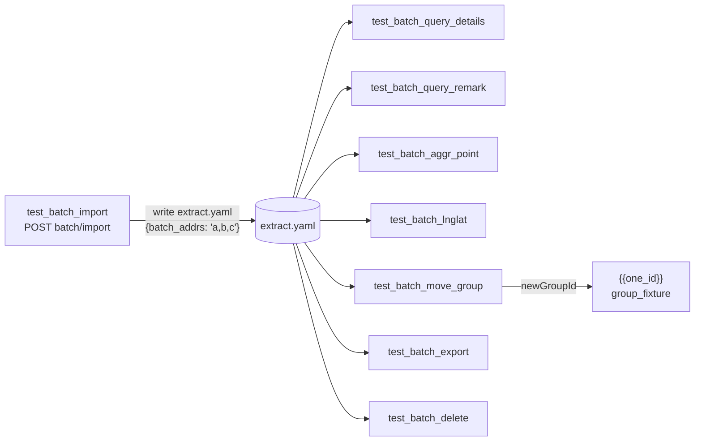

## 范围（8 个接口，全部覆盖）


| #   | 方法     | 路径                                                | YAML 顶层 key              | Python 测试方法                |
| --- | ------ | ------------------------------------------------- | ------------------------ | -------------------------- |
| 1   | POST   | `/api/monitor/terminals/batch/import`             | `batch_import_cases`     | `test_batch_import`        |
| 2   | POST   | `/api/monitor/terminals/batch/details`            | `batch_details_cases`    | `test_batch_query_details` |
| 3   | POST   | `/api/monitor/terminals/batch/remark`             | `batch_remark_cases`     | `test_batch_query_remark`  |
| 4   | POST   | `/api/monitor/terminals/batch/aggr-point-details` | `batch_aggr_point_cases` | `test_batch_aggr_point`    |
| 5   | POST   | `/api/monitor/terminals/batch/lnglat-details`     | `batch_lnglat_cases`     | `test_batch_lnglat`        |
| 6   | PUT    | `/api/monitor/terminals/batch/move-group`         | `batch_move_group_cases` | `test_batch_move_group`    |
| 7   | POST   | `/api/monitor/terminals/batch/export`             | `batch_export_cases`     | `test_batch_export`        |
| 8   | DELETE | `/api/monitor/terminals/batch`                    | `batch_delete_cases`     | `test_batch_delete`        |


## 待新增 / 修改文件

- 新增 [jkpt_api_test/testcases/test_batch_terminal_controller.py](jkpt_api_test/testcases/test_batch_terminal_controller.py)
- 新增 [jkpt_api_test/yaml/test_batch_terminal_controller.yaml](jkpt_api_test/yaml/test_batch_terminal_controller.yaml)
- 新增 `jkpt_api_test/testcases/fixtures/batch_import_template.xlsx`（Excel 测试文件，**用户本地放置**；建议从 `GET /api/monitor/templates/import-terminal` 下载后填入若干 SN 行）
- 不改 [jkpt_api_test/conftest.py](jkpt_api_test/conftest.py)（已有 `group_fixture`、`auth_headers`、清理逻辑全部复用）

## 数据链路（单文件内 import → 其它接口 → delete）




关键约定：

- 上游 `test_batch_import` 正向 `code==0` 时，从 `$.data.addedTerminals[*].addr` 提取后用 `write_yaml("./extract.yaml", {"batch_addrs": ",".join(addrs)}, mode="append")` 写入；类级布尔 `_first_batch_extracted = False` 控制只写第一次。
- 下游统一用 `_resolve_value("{{batch_addrs}}", required=True)`；缺失则 `pytest.skip`。
- pytest 默认按文件内方法顺序执行，把 `test_batch_import` 放在最前、`test_batch_delete` 放在最后即可保证链路。
- 沿用 [test_terminal_controller.py](jkpt_api_test/testcases/test_terminal_controller.py) 已有的 `_resolve_value` / `_get_variable` / `_assert_and_report` 三个私有方法（同模式复制即可）。

## 关键实现要点

### import（multipart 文件上传）

- `BaseRequest.send_request` 已支持 `files={}` 参数；用 `with open(path,"rb") as f: files={"importFile":("batch_import_template.xlsx", f)}`。
- 文件路径常量：`os.path.join(os.path.dirname(__file__), "fixtures", "batch_import_template.xlsx")`，`pytest.skip` 当文件不存在。
- 负向：`item: "no_file"`（不传 files）、`item: "empty_file"`（传空内容）等。

### export（二进制下载）

- 请求体为字符串数组（注意不是对象）：`json=[addr1, addr2, ...]`。
- 增加 header `Time-Zone: Asia/Shanghai`。
- 不能调 `res.json()`；用 `res.status_code == 200 and len(res.content) > 0` 走单独断言分支；YAML `expected` 仅保留 `code`（用 200 表示 HTTP 状态），自定义 `_assert_export_result` 或在 `_assert_and_report` 内加 `if case.get("binary_response")` 分支。

### query 三件套（details / remark / aggr-point / lnglat）

- request body 形如 `{"addrs": "a,b,c"}`（lnglat 是 `{"addr": "...", "points":[{"lat":..,"lng":..}], "page":1, "pageSize":100}`）。
- 正向断言 `code == 0`；负向覆盖：`addrs` 为空串、不存在的 addr、缺 token (`no_auth: true`)。

### move-group

- body：`{"addrs":"{{batch_addrs}}", "newGroupId":"{{one_id}}"}`；`newGroupId` 复用 `group_fixture["one_id"]`，按现有写法 `if "{{one_id}}" in str(case.get("newGroupId")): nid = group_fixture.get("one_id")`。
- 负向：`newGroupId` 非法、`addrs` 为空。

### delete

- DELETE 带 body 已在 `conftest.py` 清理代码用过：`http.send_request("delete", url, json={"addrs": "a,b,c"}, ...)`。
- 放在最后；删除后 `extract.yaml` 中的 `batch_addrs` 失效不影响后续（已无后续用例）。
- 负向：`addrs` 为空、`addrs` 全部不存在。

## YAML 结构示例（节选）

```yaml
batch_import_cases:
  - name: "批量导入设备-正向"
    file_path: "fixtures/batch_import_template.xlsx"
    expected: { code: 0, error_msg: "成功" }
  - name: "批量导入设备-负向-未上传文件"
    file_path: ""
    expected: { code: 1001, error_msg: "导入文件不能为空" }

batch_details_cases:
  - name: "批量查询详情-正向"
    addrs: "{{batch_addrs}}"
    expected: { code: 0, error_msg: "成功" }
  - name: "批量查询详情-负向-addrs为空"
    addrs: ""
    expected: { code: 1001, error_msg: "设备地址不能为空" }

batch_lnglat_cases:
  - name: "经纬度批量查询-正向"
    addr: ""
    points:
      - { lat: 22.5, lng: 113.9 }
      - { lat: 23.5, lng: 114.9 }
    page: 1
    pageSize: 100
    expected: { code: 0, error_msg: "成功" }

batch_move_group_cases:
  - name: "批量移动分组-正向"
    addrs: "{{batch_addrs}}"
    newGroupId: "{{one_id}}"
    expected: { code: 0, error_msg: "成功" }

batch_export_cases:
  - name: "批量导出-正向"
    addrs: "{{batch_addrs}}"
    binary_response: true
    expected: { code: 200, error_msg: "" }

batch_delete_cases:
  - name: "批量解绑设备-正向"
    addrs: "{{batch_addrs}}"
    expected: { code: 0, error_msg: "成功" }
```

> 实际错误码 / 错误文案以服务返回为准，首次跑通后回填（与现有 `test_terminal_controller.yaml` 同处理方式）。

## 用例数预估（每接口 1 正 + 1~2 负向）

- import: 1 正 + 2 负（无文件、空文件）
- details / remark / aggr-point: 各 1 正 + 2 负（addrs 为空、不存在的 addr）
- lnglat: 1 正 + 2 负（points 为空、缺 page）
- move-group: 1 正 + 2 负（newGroupId 不存在、addrs 为空）
- export: 1 正 + 1 负（addrs 为空）
- delete: 1 正 + 1 负（addrs 为空）→ 放最后
- 合计约 24 用例

## Apifox 数据来源（已验证）

通过 `read_project_oas_fy1hj8` + `read_project_oas_ref_resources_fy1hj8` 读取：

- `/paths/_api_monitor_terminals_batch*.json`
- `/components/schemas/TerminalBatchQueryReqDto.json`、`TerminalBatchMoveGroupReqDto.json`、`TerminalLngLatBatchQueryReqDto.json`、`TerminalAggrPointBatchQueryReqDto.json`、`PointReqDto.json`

