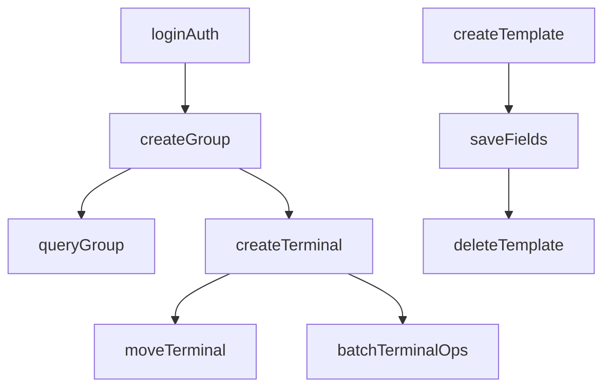

# 设备管理接口用例输出方案

## 目标

基于 Postman Folder `30348422-ee88ae0a-2629-4507-ae87-0a676f969f38`，在现有自动化测试框架基础上输出 `pytest + YAML` 形式的设备管理模块接口用例方案。

当前已确认可直接复用的现有能力：
- [C:\Users\33606\Desktop\jkpt_api_test\jkpt_api_test\conftest.py](C:\Users\33606\Desktop\jkpt_api_test\jkpt_api_test\conftest.py) 已提供 `base_url`
- [C:\Users\33606\Desktop\jkpt_api_test\jkpt_api_test\conftest.py](C:\Users\33606\Desktop\jkpt_api_test\jkpt_api_test\conftest.py) 已提供 `auth_token`
- [C:\Users\33606\Desktop\jkpt_api_test\jkpt_api_test\conftest.py](C:\Users\33606\Desktop\jkpt_api_test\jkpt_api_test\conftest.py) 已提供 `auth_headers`
- 失败时已支持请求/响应上下文附加

因此本方案不再包含“重新搭建最小框架”的内容，而是聚焦“基于现有框架输出设备管理模块用例”。

## Postman 范围

目标 Folder 归属：
- Workspace：`My Workspace`
- Collection：`监控平台`
- Folder：`设备管理`

Folder 下共 4 个子模块、33 个接口：
- `分组管理 (Group Controller)`：10 个接口
- `设备管理 (Terminal Controller)`：10 个接口
- `设备批量管理 (Terminal Batch Controller)`：8 个接口
- `字段模板管理 (Field Template Controller)`：5 个接口

## 输出结构

建议保持“薄测试文件 + 厚 YAML 数据”的模式。

本次输出覆盖该 Folder 的 4 个模块（33 个接口），共 8 个文件：
- [C:\Users\33606\Desktop\jkpt_api_test\jkpt_api_test\testcases\test_group_controller.py](C:\Users\33606\Desktop\jkpt_api_test\jkpt_api_test\testcases\test_group_controller.py)
- [C:\Users\33606\Desktop\jkpt_api_test\jkpt_api_test\testcases\test_terminal_controller.py](C:\Users\33606\Desktop\jkpt_api_test\jkpt_api_test\testcases\test_terminal_controller.py)
- [C:\Users\33606\Desktop\jkpt_api_test\jkpt_api_test\testcases\test_terminal_batch_controller.py](C:\Users\33606\Desktop\jkpt_api_test\jkpt_api_test\testcases\test_terminal_batch_controller.py)
- [C:\Users\33606\Desktop\jkpt_api_test\jkpt_api_test\testcases\test_field_template_controller.py](C:\Users\33606\Desktop\jkpt_api_test\jkpt_api_test\testcases\test_field_template_controller.py)
- [C:\Users\33606\Desktop\jkpt_api_test\jkpt_api_test\yaml\test_group_controller.yaml](C:\Users\33606\Desktop\jkpt_api_test\jkpt_api_test\yaml\test_group_controller.yaml)
- [C:\Users\33606\Desktop\jkpt_api_test\jkpt_api_test\yaml\test_terminal_controller.yaml](C:\Users\33606\Desktop\jkpt_api_test\jkpt_api_test\yaml\test_terminal_controller.yaml)
- [C:\Users\33606\Desktop\jkpt_api_test\jkpt_api_test\yaml\test_terminal_batch_controller.yaml](C:\Users\33606\Desktop\jkpt_api_test\jkpt_api_test\yaml\test_terminal_batch_controller.yaml)
- [C:\Users\33606\Desktop\jkpt_api_test\jkpt_api_test\yaml\test_field_template_controller.yaml](C:\Users\33606\Desktop\jkpt_api_test\jkpt_api_test\yaml\test_field_template_controller.yaml)

覆盖范围明确包含：
- `设备批量管理 (Terminal Batch Controller)`
- `字段模板管理 (Field Template Controller)`

## 复用现有框架的方式

### 1. 公共配置不重复下沉

由于 `conftest.py` 已经处理：
- `base_url`
- 登录获取 Token
- `Authorization` 请求头
- 会话级初始化与清理

所以新生成的设备管理测试文件不再自行维护这些内容，只通过 fixture 引用：
- `base_url`
- `auth_headers`

### 2. 请求头拆分策略

Postman 中的固定头：
- `Accept-Language`
- `x-api-env`
- `x-api-releasedate`
- `x-client-version-name`
- `Origin`
- `Referer`

建议拆成两层：
- 认证相关头继续复用 `auth_headers`
- 非认证固定头放入 YAML 的 `defaults.headers`

这样可以避免把 `Token` 写死在 YAML，同时保留 Postman 的业务头语义。

### 3. 动态变量策略

设备管理接口大量依赖运行时资源：
- `group_id`
- `one_id`
- `terminal_id`
- `template_id`

这些变量不应在首版 YAML 中写死，建议：
- 可从前置接口提取的值写入 `extract.yaml`
- 暂时无法自动闭环的值标记为 `TODO`

## YAML 输出规范（与 README 对齐）

按 [C:\Users\33606\Desktop\jkpt_api_test\jkpt_api_test\plan\README.md](C:\Users\33606\Desktop\jkpt_api_test\jkpt_api_test\plan\README.md) 的风格，采用“模块级 `*_cases` + 业务字段平铺 + `expected`”结构，不使用通用 `cases/request/assertions` 套壳格式。

分组管理示例（计划中统一采用类似结构）：

```yaml
# yaml/test_group_controller.yaml
group_cases:
  - name: "添加分组-一级分组-正向"
    parentId: 0
    groupName: "AUTO_GROUP_L1"
    expected:
      code: 0
      msg: "success"

  - name: "添加分组-一级分组-负向-名称为空"
    parentId: 0
    groupName: ""
    expected:
      code: 1001
      error_msg: "分组名称不能为空"
```

设备管理示例：

```yaml
# yaml/test_terminal_controller.yaml
terminal_cases:
  - name: "设备类型查看-正向"
    expected:
      code: 0
      msg: "success"

  - name: "设备类型查看-负向-缺少Token"
    no_auth: true
    expected:
      code: 401
      error_msg: "未授权"
```

字段约定（按 README 风格落地）：
- 顶层 key 使用 `group_cases` / `terminal_cases` / `terminal_batch_cases` / `field_template_cases`
- 每条用例必须包含：`name`、`expected.code`；正向再加 `expected.msg`，负向再加 `expected.error_msg`
- **method 和 path 不写在 YAML 中**，而在 Python 测试代码里写死（保持"薄 YAML + 厚 Python"原则）
- 业务参数平铺在用例节点中（例如 `groupId`、`terminalId`、`groupName`）
- 仅在确有需要时增加控制字段（例如 `no_auth`、`need_extract`）
- 动态依赖值先用 `TODO_*` 占位，后续由提取链路替换

## 分阶段方案

### 阶段 1：按模块“单接口跑通”（每个接口都有正向+负向）

你要求的执行策略是：**不做 4～6 条冒烟的中间计划**，而是按模块顺序，把该模块的接口一个个“先跑通”，并且每个接口都要具备**正向用例 + 负向用例**（至少 1 条负向）。

模块顺序与接口数量：
- `分组管理 (Group Controller)`：10（先做）
- `设备管理 (Terminal Controller)`：10
- `设备批量管理 (Terminal Batch Controller)`：8
- `字段模板管理 (Field Template Controller)`：5（最后做）

对“单接口跑通”的判定标准（建议写入用例验收口径）：
- 正向：请求成功，关键字段断言通过（HTTP 状态码 + 业务码/关键字段存在）
- 负向：至少覆盖 1 条高价值错误输入（缺参/非法值/越权/不存在的 ID），断言明确（业务码/错误信息/状态码）
- 用例可重复执行：不依赖手工改 YAML（依赖的动态值通过提取或 fixture/变量完成）

产出方式：
- 每个模块 1 个 `pytest` 文件 + 1 个 YAML（YAML 中按接口分组/打 tag）
- 优先把接口全部落表（case_id / method / path / 参数形态 / 断言点），然后逐个把 `TODO` 变成可执行的数据

### 阶段 2：补接口关联上下文，设计多接口串联场景

当 4 个模块都完成“单接口跑通”后，再进入你要求的第二阶段：基于业务上下文把接口串起来，形成**多接口链路场景**（可理解为端到端流程用例）。

典型串联链路（示例）：
- 分组：创建分组 → 查询分组 → 编辑分组 → 删除分组
- 设备：创建/导入设备 → 查询设备列表/详情 → 编辑设备 → 移动分组 → 删除/解绑
- 批量：批量查询详情/备注 → 批量移动/解绑 → 结果校验
- 模板：创建模板 → 保存字段 → 查询列表 → 删除模板



串联阶段的核心设计点：
- 统一变量提取与作用域（建议集中在 `extract.yaml` 或统一变量仓库）
- 统一数据清理策略（避免脏数据导致重复执行失败）
- 明确每条链路的“前置条件/后置条件/可重复执行策略”

对依赖资源的接口建立串联关系：

建议提取变量（两阶段通用）：
- `group_id`：分组相关与设备归属
- `terminal_id`：设备相关与批量操作
- `template_id`：字段模板相关

### 可选补充：文件上传场景（按需）

优先补这些高价值场景：
- 缺少 Token
- 必填字段为空
- 非法 ID
- 文件上传缺失
- 文件格式错误

涉及文件接口时，再补样例资源目录，例如：
- [C:\Users\33606\Desktop\jkpt_api_test\jkpt_api_test\data\files](C:\Users\33606\Desktop\jkpt_api_test\jkpt_api_test\data\files)

## 交付顺序

建议按以下顺序实施：
1. 输出并跑通 `分组管理 (10)`：`test_group_controller.py` + `test_group_controller.yaml`（逐接口补齐正/负用例）
2. 输出并跑通 `设备管理 (10)`：`test_terminal_controller.py` + `test_terminal_controller.yaml`
3. 输出并跑通 `设备批量管理 (8)`：`test_terminal_batch_controller.py` + `test_terminal_batch_controller.yaml`
4. 输出并跑通 `字段模板管理 (5)`：`test_field_template_controller.py` + `test_field_template_controller.yaml`
5. 第二阶段：基于业务上下文设计多接口串联场景，并落到新的 `testcases/test_device_management_scenarios.py`（或按场景拆分多个文件）与对应 YAML

## 风险与注意点

- Postman 中的 `x-request-time` 不适合静态固化到 YAML，建议运行时生成。
- 上传类接口不能只转换字段，还需要规划样例文件。
- 某些接口名称看起来可直接执行，但实际上依赖已有分组或设备数据。
- 首批最小闭环不要一次覆盖 33 个接口，否则会把主要时间消耗在前置数据修复上。

## 本次计划结论

你当前项目已经具备公共认证与基础框架，所以后续实施不应再重复建设底层能力，而应直接进入“设备管理模块 YAML 化与测试文件拆分”阶段。

首批最优落点：
- `分组管理`
- `设备管理`

首批最优目标：
- 第一阶段：按模块把所有接口逐个跑通（每个接口包含正向+负向）
- 第二阶段：再做上下文关联，形成多接口串联场景
