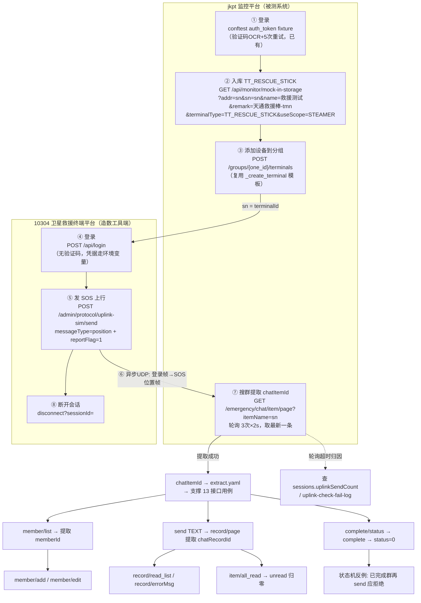

# 求救群聊（emergency/chat/*）接口自动化测试计划

> 来源：[api-automation-coverage-gap.plan.md](./api-automation-coverage-gap.plan.md) §4.1 P0 第一梯队
> Apifox tag：`应急-求救群聊接口`（13 个）+ 造数/测试桩 2 个
> 契约基准：Apifox OAS 2026-08-14 拉取；10304 平台 api-docs 2026-08-14 实测（以最新文档为准）
> 造数链定稿：v4（2026-08-14 与主人对齐）

---

## 范围（13 个被测接口 + 辅助接口）

### 被测（13）

| # | 接口 | 方法 | 核心参数 | 定位 |
|---|------|------|----------|------|
| 1 | `/api/monitor/emergency/chat/item/page` | GET | itemName(模糊)、page、pageSize | 群聊列表（也是造数验证口） |
| 2 | `/api/monitor/emergency/chat/member/list` | GET | chatItemId | 成员查询 |
| 3 | `/api/monitor/emergency/chat/member/add` | POST | JSON: chatItemId、memberAccount、memberAccountType(enum×4)、nickname | **成员添加（越权面）** |
| 4 | `/api/monitor/emergency/chat/member/edit` | POST | JSON: memberId、nickname | 成员编辑 |
| 5 | `/api/monitor/emergency/chat/send` | POST | query: chatItemId、sendType(enum: ALARM/IMAGE/OK/TEXT/VOICE)、content、file?、fileSize?、reportId? | **消息发送（触达+幂等核心）** |
| 6 | `/api/monitor/emergency/chat/record/page` | GET | chatItemId、page、pageSize | 聊天记录 |
| 7 | `/api/monitor/emergency/chat/item/all/read` | GET | chatItemId | 全部已读（幂等） |
| 8 | `/api/monitor/emergency/chat/record/read/list` | GET | chatRecordId | 已读/未读成员 |
| 9 | `/api/monitor/emergency/chat/record/errorMsg` | GET | chatRecordId | 下发失败原因（触达验证） |
| 10 | `/api/monitor/emergency/chat/item/complete` | GET | chatItemId | **救援完成（状态机）** |
| 11 | `/api/monitor/emergency/chat/item/complete/status` | GET | chatItemId | 完成按钮状态 |
| 12 | `/api/monitor/emergency/chat/item/complete/addr` | POST | JSON: addrs[]、handleResult；**Authorization 在 header** | 管理后台批量完成 |
| 13 | `/api/monitor/emergency/chat/item/clear/all-unread` | PUT | — | 清空全部未读（幂等） |

### 辅助（非被测，造数/清理用）

**jkpt 监控平台侧：**

| 接口 | 用途 |
|------|------|
| `GET /api/monitor/mock-in-storage` | **设备入库**（query: addr、sn、name、remark、terminalType、useScope）——救援终端正规注册入口 |
| `GET /api/monitor/mock-in-storage/inventory/{sn}` | 按 sn 查入库结果（Spike 验证用） |
| `GET /api/monitor/test/emergency-chat-item/expiration` | **测试桩**：按 chatItemId + inactiveMillis 关闭群聊（仅测试环境）；用于清理与"自动关闭"验证 |

**10304 卫星应急救援终端平台侧（造数工具端，需 cookie 登录）：**

| 接口 | 用途 |
|------|------|
| `POST http://120.77.17.225:10304/api/login` | 平台登录（无验证码；凭据走环境变量，不落文档） |
| `POST /admin/protocol/uplink-sim/send` | **SOS 上行模拟核心**（UplinkSimForm JSON body，见下方定稿参数） |
| `POST /admin/protocol/uplink-sim/disconnect?sessionId=` | 断开模拟会话（清理） |
| `GET /admin/protocol/uplink-sim/sessions` | 查活跃会话（归因：uplinkSendCount 是否增长） |
| `POST/PUT/DELETE /admin/protocol/terminal-status/mock-terminal*` | 模拟终端注册 CRUD（S2 待验证是否为 send 前置） |

### 明确不在本计划范围

- `emergency/combo/*`（求救套餐，计费链路，独立计划处理——与 order/star-bean 串测）
- `app-users/*` 紧急联系人绑定（v4 链路已不依赖；10304 上行模拟为唯一造数入口）

---

## 造数链路（v4 定稿：求救群聊创建全链）

### 全景图



### 步骤明细

| # | 端 | 动作 | 关键取值 | 失败处理 |
|---|-----|------|----------|----------|
| ① | jkpt | 登录 | 复用 conftest `auth_token` | 已有机制 |
| ② | jkpt | 设备入库 | `GET mock-in-storage`：addr=sn、sn=sn、name=救援测试、**remark=天通救援棒-tmn**、terminalType=**TT_RESCUE_STICK**、useScope=STEAMER | fail，不静默复用 |
| ③ | jkpt | 添加到 one_id 分组 | 复用 `_create_terminal` 请求体模板，terminalType=TT_RESCUE_STICK | fail |
| ④ | 10304 | 登录拿 cookie | `POST /api/login`，凭据环境变量（如 `RESCUE_PLATFORM_USER/PASSWORD`） | fail |
| ⑤ | 10304 | 发 SOS | 主人定稿样例：serverHost=**120.77.17.225**、serverPort=**10306**、transport=udp、messageType=**position**、reportFlag=**1**、terminalId=**sn**、hardwareId=ABCDEF1234（S1 待验证）、**longitude=113.461605、latitude=23.171917**、altitude=50、speed=0、direction=0、terminalBusinessId=**2** | code:0 后仍需⑦终态验证 |
| ⑥ | （异步） | UDP 登录帧→SOS 位置帧 | — | 静默失败需⑦轮询兜住 |

### 终端上行报文全集（6 种形态，2026-08-14 主人定稿）

> **模板定稿原则：样例报文即模板，唯一变量是 terminalId（设备卡号），其余字段一律照抄不改**（hardwareId=ABCDEF1234、serverHost=120.77.17.225、serverPort=10306、transport=udp、坐标=113.461605,23.171917、altitude=50、speed=0、direction=0）。

| # | messageType | 关键参数 | 语义 | 造数用途 |
|---|-------------|----------|------|----------|
| **U0** | **login** | 仅 5 个基础字段，无业务字段 | **仅登录建会话** | 设备上线前置 / 终端在线状态场景 |
| U1 | position | reportFlag=**0**、bizId=2 | 普通位置上报 | 群内位置记录 / 设备心跳 |
| U2 | position | reportFlag=**1**、bizId=2 | 按键 SOS | **建群主入口**（步骤⑤） |
| U3 | position | reportFlag=**2**、bizId=2 | 落水 SOS | 建群变体场景 |
| U4 | position | reportFlag=**10**、bizId=2 | 取消 SOS | **状态机场景**：取消后群聊行为验证 |
| U5 | speech | codeRate=**2** + speechHex（412B 定稿样本）+ bizId=**3** | 语音上行 | **群内 VOICE 记录造数**：支撑 record/page、read/list、errorMsg、all_read 等用例的前置数据；也是 emergency/chat/send VOICE（file 传法存疑）的协议层备选来源 |

**语音样本要点**（主人提供，直接复用）：
- speechHex 为 412 字节多帧压缩码流（`0345caa` 帧分隔 ×68），样本已验证合法，**作为定稿模板原样内嵌**；
- 造新语音：10304 `POST /admin/protocol/uplink-sim/speech-encode`（PCM hex + rateName → 压缩 HEX），非必需；
- **terminalBusinessId 按类型固定**：位置报文=2，语音报文=3。
| ⑦ | jkpt | 搜群取 ID | `item/page?itemName={sn}`，轮询 3×2s，**取最新** | 超时查 10304 会话/失败日志归因 |
| ⑧ | 10304 | 断开会话 | `disconnect`（sessionId 从⑤响应取） | 尽力清理 |
| ⑨ | session 末 | 三路清理 | jkpt 删设备/分组（现有 `cleanup_test_data`）+ glht 按 sn 精确清单删入库记录 + 10304 会话已断 | — |

### 四个机制认知（不写清会踩坑）

| # | 认知 | 来源 |
|---|------|------|
| 1 | **⑤ HTTP code:0 ≠ 群聊建成**——send 是异步模拟器；**login 是独立报文形态（U0），非 position 内部步骤**，调用方按需显式单发 | 2026-08-14 实测 + 主人指正 |
| 2 | **serverHost 精确性**：120.77.17.225 错一位不报错、链路静默断 | 实测 |
| 3 | **登录双轨**：jkpt 走 token（query Authorization）；10304 走 cookie 会话（`POST /api/login` 强制，401 实锤） | 实测 |
| 4 | **SN 纯数字**（卡号不支持字母）：`20260814`+4位盐+3位序号（15位，复用 `terminal_type_enum_cases` 已验证写法） | 主人指正 |
| 5 | **样例即模板**：主人提供的报文除 terminalId 外全部为定稿固定值，不猜不改不参数化 | 主人定稿 |

### Spike 待验证项（不阻塞链路成立）

| # | 项 | 说明 |
|---|-----|------|
| S1 | ~~hardwareId 取值~~ | **已销**：主人定稿 hardwareId=ABCDEF1234 固定值，样例即模板，唯一变量为 terminalId |
| S2 | terminalId 是否需先在 10304 mock-terminal 注册 | 实测确认（主人样例 terminalId=123456 直接 send 成功，倾向不需要，需监控平台侧建群验证） |
| S3 | 15 位 sn 两端接受度 | 现有设备 14 位；枚举用例 15 位通过过 |
| S3.5 | itemName 搜 sn 的命中格式 | 群名 `SOS-{addr}-xx`；搜不到则按 remark「天通救援棒-tmn」兜底或取时间最新群 |
| S4.5 | ~~reportFlag=3 语义~~ | **已销**：主人确认为 10（取消SOS）误记，全集锁定 0/1/2/10，与 OAS 契约一致 |
| S4.6 | speech 上行实发 | 用 412 字节定稿样本发 U5，验证群内产生 VOICE 记录（record/page 可查、read/list 可用） |
| S4.7 | reportFlag=10 取消SOS 实测 | 建群后发 reportFlag=10，验证群聊终态（是否等价 complete、消息是否停收）——状态机用例 U4 的依据 |

### 废弃方案存档（迭代淘汰，勿再采用）

| 废弃项 | 淘汰原因 |
|--------|----------|
| ~~h5-mock/mock-sos 造数~~ | byte 参数无文档；正规入口为 10304 uplink-sim/send（主人指定） |
| ~~直调 receive-event/position-report 造数~~ | 跳过 10304 中间处理环节的权宜推断，被纠正 |
| ~~RESQ 字母前缀 SN~~ | 卡号不支持字母（主人指正） |
| ~~glht 按日期模糊删入库记录~~ | 霰弹枪误删风险 → sn 精确清单 |
| ~~固定 SN 复用救援设备~~ | 群聊状态累积 + 00105 被占用实锤 → 时间戳新建 |

---

## 用例数据链路（chatItemId 提取后）

**群聊状态机**（`EmergencyChatItemDto.status`）：`1=救援中 ⇄ 0=救援完成`。核心守恒验证：complete 后不可逆（再 send 应被拦截）。

---

## 待新增 / 修改文件

| 文件 | 动作 | 说明 |
|------|------|------|
| `testcases/test_emergency_chat_controller.py` | 新增 | 13 个接口用例（模式 B′，链式依赖走 extract.yaml） |
| `yaml/test_emergency_chat_controller.yaml` | 新增 | 分场景多顶层 key（§YAML 结构） |
| `conftest.py` | 修改（+2 fixture） | `rescue_sat_terminal`（入库+添加，返回 sn）；`emergency_chat_item`（发 SOS+搜群提取 chatItemId，依赖前者） |
| `common/rescue_platform_client.py` | 新增 | 10304 平台客户端：cookie 登录、uplink-sim/send、disconnect、sessions 查询封装 |
| `plan/terminal-inventory-cleanup.plan.md` | 落地 | glht 按 sn 精确清单删入库记录（pending todos 实施时按本口径改造） |

**fixture 设计**（对齐 conftest-jkpt.md 惯例，session 级）：

```python
@pytest.fixture(scope="session")
def rescue_sat_terminal(base_url, auth_headers, group_fixture) -> str:
    """②入库(GET mock-in-storage, terminalType=TT_RESCUE_STICK,
    remark=天通救援棒-tmn, 纯数字时间戳sn) + ③添加到 one_id 分组。
    返回 sn。任一步失败 pytest.fail（不静默复用）。
    sn 同步存 pytestconfig.stash 供 glht 清理精确匹配。"""

@pytest.fixture(scope="session")
def emergency_chat_item(base_url, auth_headers, rescue_sat_terminal) -> dict:
    """④⑤登录10304并发SOS(position, reportFlag=1, 113.461605,23.171917)
    → ⑦轮询 item/page?itemName=sn 取最新 → 返回
    {"chatItemId":..., "sn":..., "itemName":...}。
    ⑧用例阶段结束后 disconnect 会话。失败带两端完整请求/响应上下文。"""
```

> 不在 conftest 写 extract.yaml（技能红线）；fixture 只返回 dict，chatItemId 由用例层 `write_yaml` 持久化。

---

## 参数传递规范（按 api-test-framework 技能）

### 通道A：Fixture 注入

| 依赖 | 来源 | 注入方式 |
|------|------|----------|
| `base_url` / `auth_headers` | conftest 已有 | 直接注入 |
| `msg_test_terminal` | conftest 已有（addr） | SOS 发起设备 |
| `emergency_chat_item` | **本计划新增** | 造数群聊上下文 |

### 通道B：extract.yaml（同文件链路）

| 占位符 | 写入时机 | 消费方 |
|--------|----------|--------|
| `{{emergency_chat_item_id}}` | a0 造数用例提取 | member/*、send、record/*、item/all_read、complete/* |
| `{{emergency_member_id}}` | member/add 或 member/list 提取 | member/edit |
| `{{emergency_chat_record_id}}` | send 成功后从 record/page 提取 | record/read_list、record/errorMsg |
| `{{emergency_completed_item_id}}` | complete 成功后回写 | 状态机反例用例（已完成再 send） |

---

## 接口详情与用例设计矩阵

> 断言分层：状态码 → code/msg（assert_api_result）→ **业务语义**（status/unreadCount 变迁）→ 副作用（record/page 落库、成员列表变化）。

### 0. a0 前置造数（Spike 转正式用例）

| 用例 | 场景 | 断言 |
|------|------|------|
| a0-1 造群正向 | ②入库+③添加（fixture）→ ⑤uplink-sim/send(reportFlag=1) → ⑦item/page 按 itemName=sn 轮询查新群（3×2s，复用 alarm 短轮询兜底模式） | 查到新群聊且 status=1；提取 chatItemId 写 extract |

### 1. item/page 群聊列表

| 用例 | 场景 | 断言 |
|------|------|------|
| 1-1 正向 | 默认分页 | code=0，data 结构含 items，造数群聊在列 |
| 1-2 模糊查询 | itemName=造数群名片段 | 命中且仅命中目标 |
| 1-3 负向-无token | no_auth | code=3001 |
| 1-4 边界 | page=0、pageSize=1000 | 不 5xx，行为与默认一致或合理降级 |

### 2. member/list 成员查询

| 用例 | 场景 | 断言 |
|------|------|------|
| 2-1 正向 | 造数群聊 | code=0，成员列表非空（至少含 SOS 接收人） |
| 2-2 负向-chatItemId不存在 | 随机串 | 非 0 code，不 5xx |
| 2-3 负向-chatItemId为空 | "" | 参数校验错误码 |
| 2-4 负向-无token | no_auth | 3001 |

### 3. member/add 成员添加（越权面 ⭐）

`memberAccountType` 枚举：`APP_INTERCOM / ENTERPRISE_ACCOUNT / PERSONAL_ACCOUNT / TERMINAL_DEVICE`

| 用例 | 场景 | 断言 |
|------|------|------|
| 3-1 正向-企业账号 | memberAccount=当前测试账号，type=ENTERPRISE_ACCOUNT | code=0；**副作用**：member/list 中出现该成员 |
| 3-2 边界-设备类型成员 | type=TERMINAL_DEVICE，account=测试设备 addr | code=0 或明确业务拒绝码 |
| 3-3 负向-type非法值 | type="HACKER" | 参数校验错误 |
| 3-4 负向-memberAccount为空 | "" | 参数校验错误 |
| 3-5 负向-chatItemId不存在 | 随机串 | 非 0，不 5xx |
| 3-6 幂等-重复添加 | 同一成员连续 add 两次 | 第二次要么幂等成功（列表仍只 1 条），要么明确"已存在"码；**绝不产生 2 条记录** |
| 3-7 负向-无token | no_auth | 3001 |

### 4. member/edit 成员编辑

| 用例 | 场景 | 断言 |
|------|------|------|
| 4-1 正向 | 改 nickname | code=0；副作用：member/list 昵称已变 |
| 4-2 负向-memberId不存在 | 随机串 | 非 0，不 5xx |
| 4-3 负向-memberId为空 | "" | 参数校验错误 |

### 5. send 消息发送（触达+幂等核心 ⭐⭐）

| 用例 | 场景 | 断言 |
|------|------|------|
| 5-1 正向-TEXT | sendType=TEXT + content | code=0；**副作用**：record/page 立即/轮询后可见该 content |
| 5-2 正向-VOICE | sendType=VOICE + file + fileSize | code=0；record 中 lastChatType=VOICE（**file 传法待实测**，见风险3） |
| 5-3 负向-sendType非法 | "VIDEO" | 参数校验错误 |
| 5-4 负向-TEXT缺content | content="" | 参数校验错误（契约：TEXT 时必填） |
| 5-5 负向-chatItemId不存在 | 随机串 | 非 0，不 5xx |
| 5-6 幂等-reportId去重 | 同 reportId 连发两次 | **仅 1 条记录落库**（reportId 疑似幂等键，探索性验证；若不幂等则记录为缺陷线索） |
| 5-7 状态机-已完成群聊再发 | 用 `{{emergency_completed_item_id}}` | **必须拒绝**（非 0）；非法跃迁拦截是本计划最高优先断言 |
| 5-8 负向-无token | no_auth | 3001 |

### 6. record/page 聊天记录

| 用例 | 场景 | 断言 |
|------|------|------|
| 6-1 正向 | 造数群聊分页 | code=0，含 5-1 发送的 content；提取 chatRecordId 写 extract |
| 6-2 边界 | pageSize=1 多页翻页 | 总条数守恒（第1页+第2页 = 发送总数） |
| 6-3 负向-chatItemId不存在 | 随机串 | 非 0，不 5xx |

### 7. item/all/read 全部已读（幂等）

| 用例 | 场景 | 断言 |
|------|------|------|
| 7-1 正向 | send 后调用 | code=0；**副作用**：item/page 中该群 unreadCount=0 |
| 7-2 幂等-重复调用 | 连续 2 次 | 均 code=0，unreadCount 仍 0，无副作用翻倍 |
| 7-3 负向-chatItemId不存在 | 随机串 | 非 0，不 5xx |

### 8. record/read/list 已读未读成员

| 用例 | 场景 | 断言 |
|------|------|------|
| 8-1 正向 | 5-1 的 chatRecordId | code=0；已读/未读成员集合 ⊇ 群成员集合（守恒） |
| 8-2 负向-chatRecordId不存在 | 随机串 | 非 0，不 5xx |

### 9. record/errorMsg 下发失败原因

| 用例 | 场景 | 断言 |
|------|------|------|
| 9-1 正向-正常消息 | 5-1 的 recordId | code=0（无错误时 errorMsg 为空/成功态） |
| 9-2 触达失败场景（可选，依赖环境） | 设备离线时 send | errorMsg 返回具体失败原因（**漏触达验证口**；离线设备依赖标注，环境不具备则 skip 并注明） |

### 10. item/complete 救援完成（状态机 ⭐）

| 用例 | 场景 | 断言 |
|------|------|------|
| 10-1 前置状态确认 | complete 前查 status 接口 | isCompleted=false |
| 10-2 正向 | complete 造数群聊 | code=0；**副作用**：item/page 中 status=0 |
| 10-3 幂等-重复complete | 连续 2 次 | 第二次幂等成功或明确"已完成"码，不产生异常 |
| 10-4 负向-chatItemId不存在 | 随机串 | 非 0，不 5xx |
| 10-5 状态机闭环 | complete 后查 status | isCompleted=true（与 10-1 前后呼应） |

### 11. complete/status 完成按钮状态

（已并入 10-1 / 10-5 作前后断言；独立负向：）

| 用例 | 场景 | 断言 |
|------|------|------|
| 11-1 负向-chatItemId不存在 | 随机串 | 非 0，不 5xx |
| 11-2 语义 | 正常群聊 | hasPermission 字段存在且为 bool（web 账号权限基线记录） |

### 12. complete/addr 管理后台批量完成

> 注意：此接口 **Authorization 在 header**（其余接口在 query），实现时勿抄错位置。

| 用例 | 场景 | 断言 |
|------|------|------|
| 12-1 正向 | addrs=[造数设备addr] | code=0；副作用：该设备群聊 status=0 |
| 12-2 负向-addrs为空数组 | [] | 参数校验错误 |
| 12-3 负向-addr不存在 | 随机串 | 非 0，不 5xx |
| 12-4 幂等 | 同 addr 完成 2 次 | 不产生重复副作用 |

### 13. clear/all-unread 清空全部未读（幂等）

| 用例 | 场景 | 断言 |
|------|------|------|
| 13-1 正向 | send 产生未读后调用 | code=0；副作用：item/page 所有群 unreadCount=0 |
| 13-2 幂等 | 连续 2 次 | 均 code=0，无数值异常 |

### 14. test/expiration 自动关闭（测试桩，兼清理）

| 用例 | 场景 | 断言 |
|------|------|------|
| 14-1 正向 | chatItemId + inactiveMillis=1 | 群聊关闭（status 变化/不可再查到活跃态） |
| 14-2 负向-inactiveMillis=0/负数 | 边界 | 非 0 或明确拒绝，不 5xx |

---

## 数据清理策略（测试不留脏数据）

| 层级 | 手段 |
|------|------|
| 用例级 | 状态机用例（5-7）自备"已完成群聊"，避免污染正向链路 |
| session 级 | teardown 中 `complete/addr` 批量完成本 session 造的所有群聊（按 itemName 时间戳前缀识别，如 `SOS-AUTO-*`）；备选 `test/expiration` |
| 兜底 | 群聊无删除接口，只能"完成"不能删——遗留已完结群聊属可接受终态；在计划复盘时核对 session 内新增数 = 完结数 |

---

## YAML 结构示例

```yaml
# yaml/test_emergency_chat_controller.yaml
# 求救群聊接口（emergency/chat/*）— 13 个接口

item_page_cases:
  - name: "群聊列表-正向-默认分页"
    expected: { code: 0, msg: "成功" }
  - name: "群聊列表-负向-缺token"
    no_auth: true
    expected: { code: 3001, error_msg: "没有访问权限" }

member_add_cases:
  - name: "添加成员-正向-企业账号"
    memberAccountType: "ENTERPRISE_ACCOUNT"
    nickname: "AUTO成员_{{ts}}"      # Python 方法体内替换时间戳
    expected: { code: 0, msg: "成功" }
  - name: "添加成员-负向-类型非法"
    memberAccountType: "HACKER"
    expected: { code: 1001, error_msg: "参数错误" }   # 实际码以 Spike 摸底为准

send_cases:
  - name: "发送消息-正向-TEXT"
    sendType: "TEXT"
    content: "AUTO_TEST_{{ts}}"
    expected: { code: 0, msg: "成功" }
  - name: "发送消息-负向-sendType非法"
    sendType: "VIDEO"
    expected: { code: 1001, error_msg: "参数错误" }
  - name: "发送消息-状态机-已完成群聊再发"
    chatItemId: "{{emergency_completed_item_id}}"
    sendType: "TEXT"
    content: "should_be_rejected"
    expected: { code: 1001, error_msg: "群聊已结束" }  # 实际码 Spike 摸底
```

> 负向错误码（1001 等占位）**以 Spike 实测为准**，落地前先跑摸底请求校准 YAML。

---

## 用例数预估

| 类别 | 数量 |
|------|------|
| 正向 | 15 |
| 负向（参数校验/不存在/no_auth） | 19 |
| 边界（分页/枚举全集） | 6 |
| 幂等（add/send/all_read/complete/addr/clear） | 6 |
| 状态机（complete 前后闭环 + 非法跃迁） | 3 |
| 触达副作用（record 落库/unread 归零/成员可见） | 已并入正向断言 |
| **合计** | **≈ 49 条**（a0 造数 1 条不计入覆盖） |

---

## 实施步骤

1. **Spike（半天，先行）**：
   - S1: hardwareId 取值验证（先按样例 ABCDEF1234 发）
   - S2: terminalId 是否需先在 10304 mock-terminal 注册（实测）
   - S3: 15 位纯数字 sn 两端接受度
   - S4: 全链验证：入库→添加→send(reportFlag=1)→item/page 轮询建群→chatItemId 提取（**链路核心验证**）
   - S5: 校准全部负向错误码（YAML 占位值）
   - S6: 实测 `emergency/chat/send` VOICE 的 file 真实传法（query vs form-data）
   - S7: 确认 web 账号对 complete 的 hasPermission 基线
2. **fixture + 工具层**：`rescue_sat_terminal` + `emergency_chat_item` fixture + `common/rescue_platform_client.py`（10304 客户端：登录/send/disconnect/轮询）
3. **用例落地**：按 a0 → 1/2（查询类）→ 3/4（成员）→ 5/6（发送记录）→ 7/8/9（已读触达）→ 10/11（状态机）→ 12/13 → 14 顺序，每批跑通再下一批
4. **清理验证**：session 结束核对群聊终态 + glht 入库记录清理（按 sn 精确清单）
5. **回归**：全量跑 + allure 报告，失败归因

---

## 风险与待验证项（Spike 清单）

| # | 风险 | 影响 | 预案 |
|---|------|------|------|
| 1 | uplink-sim/send 异步语义：HTTP code:0 ≠ 群聊建成（错 host 也返回成功） | 造数静默失败 | ⑦轮询 item/page 兜底；超时查 sessions.uplinkSendCount / uplink-check-fail-log 归因 |
| 2 | 10304 凭据管理（当前 admin/admin@0415） | 明文泄露风险 | conftest 走环境变量 `RESCUE_PLATFORM_USER/PASSWORD`；文档已脱敏 |
| 3 | emergency/chat/send 的 file 参数 in=query 存疑 | VOICE 用例不可写 | S6 实测；form-data 优先怀疑；备选经 10304 speech-encode 链路造语音 |
| 4 | reportId 是否幂等键不确定 | 5-6 可能误报 | 用例标注探索性：不幂等 → 缺陷线索而非脚本失败 |
| 5 | 群聊无删除接口 | 数据累积 | complete/addr 批量收尾 + sn 时间戳标识（每 session 新群可辨识） |
| 6 | 9-2 触达失败场景依赖设备离线环境 | errorMsg 深度验证受限 | 环境不具备则 skip 并在报告注明盲区 |
| 7 | 越权测试仅有单一 web 账号 token | 3-x 无法测真实水平越权 | 本期只锁"非法 token/无 token"面；双账号越权矩阵列入 combo 计划一起做 |
| 8 | glht 入库清理链路未实施（plan pending） | 入库记录累积 | ⑨三路清理依赖；实施 terminal-inventory-cleanup 时按 sn 精确清单口径 |

---

## Apifox 数据来源（已核验）

- 项目：`Swagger3接口文档`（apifox-jkpt MCP），拉取时间 2026-08-14T06:33Z
- 10304 平台 `v3/api-docs`（登录后拉取），2026-08-14：`uplink-sim/send`（UplinkSimForm）、`disconnect`、`sessions`、`mock-terminal` CRUD、`ui-defaults`
- tag `应急-求救群聊接口` 13 个；tag `A-测试关闭求救群聊` → test/expiration；tag `模拟终端入库` → mock-in-storage
- DTO：`EmergencyChatItemMemberAddDto`（4 枚举）、`MemberEditDto`、`EmergencyChatItemCompleteByAddrDto`（addrs 唯一数组）、`EmergencyChatItemCompleteStatusDto`（hasPermission/isCompleted）、`EmergencyChatItemDto`（status: 0完成/1救援中，unreadCount）、`UplinkSimForm`（terminalId/hardwareId/serverHost/serverPort/messageType/reportFlag/坐标等）

---

## 执行记录（2026-08-17 收官）

### 终态：13 接口全落地，全量回归 62 passed / 0 failed

| 产物 | 内容 |
|------|------|
| `testcases/test_emergency_chat_controller.py` | a0 + 13 接口 + 状态机反例 + VOICE + 取消SOS，共 62 用例 |
| `yaml/test_emergency_chat_controller.yaml` | 14 个顶层 key，负向码全部按 2026-08-17 实测校准 |
| `conftest.py` | +2 fixture（rescue_sat_terminal / emergency_chat_item）+ `_close_rescue_chats_teardown` session 级兜底清理 |
| `common/rescue_platform_client.py` | 10304 客户端（登录/U0-U5 上行/会话管理/归因日志） |

### 关键实测发现（均已锁定为断言基线或留痕）

| # | 发现 | 处置 |
|---|------|------|
| 1 | **旧「已完成群可发消息」bug 记录系假阳性**：真实行为 `1001 "救援已结束，无法发送消息"`，状态机护栏存在。根因：`resolve_extract_value` 缺键静默回退活跃群 → 已修复为状态机场景显式 skip，不回退 | 断言改为 code!=0 + msg 锁实测值 |
| 2 | **complete/addr 全量 3001**：web 账号无管理后台权限（风险7实锤）；无 token 时返回 999（与其它接口 3001 不一致，鉴权层级差异线索） | 权限探测先行；管理账号矩阵移交 combo 计划 |
| 3 | **S6 实测定稿**：send VOICE 的 file **唯一正确传法是 form-data 文件上传**（query 纯 hex → 1001 类型转换异常；仅 fileSize → 1001 保存失败） | test_5_2 落地 |
| 4 | **S4.6 已销（通过）**：U5 语音上行正常落库；计划断言字段 `lastChatType` 系误记，真实字段为 **`sendType`**（VOICE 记录 content 为 oss 路径） | 断言按真实字段修正 |
| 5 | **S4.7 已销**：reportFlag=10 取消 SOS 后群 status 翻 0（等价 complete），且群内再发消息被拦截（状态机护栏双保险） | test_u4 落地 |
| 6 | **造数链隐含前置**：设备必须挂分组，仅入库不挂组 SOS 不建群（S2 变体实锤） | fixture 链含③挂组；Spike 脚本已删 |
| 7 | **测试桩/查询类健壮性线索**：member/list 空 ID、expiration 0/负值、read_list/errorMsg 不存在 ID 等均不校验直接成功 | YAML 注释留痕待开发确认 |

### 遗留清单

| # | 项 | 去向 |
|---|-----|------|
| 1 | complete/addr 业务语义（正向 status=0 副作用、幂等）未验证——单 web 账号无权限 | 移交 combo 计划的管理账号矩阵 |
| 2 | glht 入库记录按 sn 精确清理（terminal-inventory-cleanup.plan pending） | 独立计划实施时消费 `pytestconfig.stash["rescue_terminal_sns"]` |
| 3 | 双账号水平越权矩阵 | combo 计划 |
| 4 | 触达失败场景（9-2 设备离线 errorMsg）依赖环境 | 环境具备时补测 |
