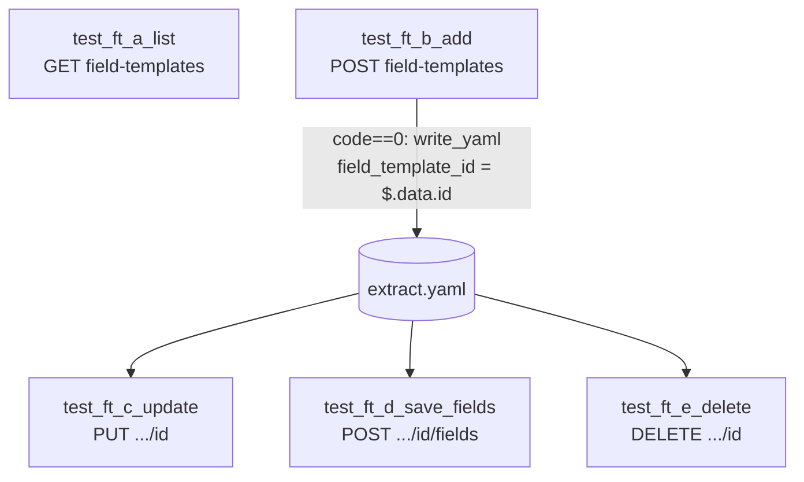

## 1. 接口范围（明确条目）

以下内容来自当前 Apifox 项目 Swagger3 文档中与「字段模板管理接口」对应的 path；实现与断言以**实际网关行为**为准，若网关与文档不一致以抓包为准。

| # | 方法 | Path | 概要 | OperationId |
|---|------|------|------|----------------|
| 1 | GET | `/api/monitor/field-templates` | 获取字段模板列表 | `listFieldTemplatesUsingGET` |
| 2 | POST | `/api/monitor/field-templates` | 添加字段模板（query：`name` 必填） | `addFieldTemplateUsingPOST` |
| 3 | PUT | `/api/monitor/field-templates/{id}` | 编辑模板名称（path：`id`；query：`name` 必填） | `editFieldTemplateUsingPUT` |
| 4 | DELETE | `/api/monitor/field-templates/{id}` | 删除模板（path：`id`） | `deleteFieldTemplateUsingDELETE` |
| 5 | POST | `/api/monitor/field-templates/{id}/fields` | 保存字段（path：`id`；query：`fields` 为字符串数组） | `saveFieldsUsingPOST` |

**不包含**：其它 monitor 模块（分组、设备、批量设备等）的任何接口 URL。

**Swagger 注意点**：文档将 `Authorization` 标成 **query 必填**；本项目现有 monitor 用例（如分组）仅用 **Header**（`auth_headers`）即可通过。实施时：**优先沿用 Header**；若出现鉴权失败，再在对应请求的 `params` 中递增 `Authorization`（值与 token 对齐）并保持 Header，记录进本文档「联调回填」小节。

---

## 2. 待新增 / 修改文件清单

| 动作 | 路径 | 说明 |
|------|------|------|
| **新增** | [jkpt_api_test/yaml/test_field_template_controller.yaml](jkpt_api_test/yaml/test_field_template_controller.yaml) | 全部场景数据 |
| **新增** | [jkpt_api_test/testcases/test_field_template_controller.py](jkpt_api_test/testcases/test_field_template_controller.py) | 参数化执行 + extract 写入 |
| **不改**（默认） | [jkpt_api_test/conftest.py](jkpt_api_test/conftest.py) | 复用 `base_url`、`auth_headers`、`clear_data_per_session` |
| **不改**（默认） | [jkpt_api_test/extract.yaml](jkpt_api_test/extract.yaml) | 仓库内保持空或可忽略；运行时由会话清理与 append 写入 |
| **不改**（默认） | [jkpt_api_test/pytest.ini](jkpt_api_test/pytest.ini) | `testpaths` 已指向 `testcases` |

可选后续（仅在发现强依赖时）：

| 动作 | 条件 |
|------|------|
| 改 `conftest` | 后端强制要求 query `Authorization` 且无法在单文件内兜底时 |
| 与 `group_fixture` 联动 | 若后续确认「字段模板」与分组/租户绑定且有接口参数要求（当前 Swagger 未见） |

---

## 3. 数据链路（单文件闭环）

依赖假设（待联调确认，无则按计划实施）：

- **无分组/设备前置**：不写 `{{one_id}}` 一类占位；链路变量仅 **`field_template_id`**。
- **同一会话**：`clear_data_per_session` 在开始时空 `extract.yaml`；仅用本文件时键名与其它模块并行存在亦可（键名自定且唯一：`field_template_id`）。



**下游读取**：与 [testcases/test_group_controller.py](jkpt_api_test/testcases/test_group_controller.py) 同款逻辑——占位符形如 `{{field_template_id}}`，`_resolve_value(..., required=True)`，缺失则 `pytest.skip`。

**写入时机**：仅在 **创建模板**正向 `code == 0` 时写入；若同一天跑多次，`append` 会覆盖同键（与现有 `write_yaml` append 语义一致则读最新）。

**DELETE 末尾**：删除成功后，内存中仍可保留过时 `extract` 键；下一次跑 session 清空。单次文件内不要求删键。

---

## 4. 关键约定

1. **pytest 收集顺序**：方法名必须使用 **`test_ft_a_`、`test_ft_b_`、…、`test_ft_e_` 前缀**（与 [testcases/test_batch_terminal_controller.py](jkpt_api_test/testcases/test_batch_terminal_controller.py) 一致），确保字典序执行顺序为 list → create → update → save_fields → delete。
2. **鉴权**：默认 `headers = { **auth_headers }`；`no_auth: true` 时用例传空 headers。
3. **请求形态**：列表 GET 可无 query；增/改一律 **params**（非 JSON body），与 Swagger 一致。
4. **`save_fields` 的数组 query**：requests 中单 key 多值须构造 `params=[("fields", v1), ("fields", v2), ...]`，禁止只用 `dict` 覆盖同 key。
5. **动态名称**：创建/更新正向的 `name` 带时间戳后缀（`get_current_datetime()` 或 `int(time.time())`），避免环境脏数据命名冲突。
6. **断言统一**：`_assert_and_report` + `assert_api_result`（[common/allure_assert_util.py](jkpt_api_test/common/allure_assert_util.py)），与分组用例一致。
7. **JSONPath**：`code` / `msg` 必取；`id` 默认 `$.data.id`，联调不对再改路径。
8. **单文件可跑性**：通过 `-k test_ft_e` 只跑删除会缺 `field_template_id` → `skip` 属预期；**完整回归**应跑整文件无 `-k` 过滤。

---

## 5. 关键实现要点（Python）

| 主题 | 要点 |
|------|------|
| 列表 GET | `send_request("get", url, headers=headers, params可选空dict)` |
| 创建 POST | `params={"name": resolved_name}`；成功写 extract |
| 更新 PUT | `url` 含 `f"{base_url}/api/monitor/field-templates/{tid}"`，`params={"name": ...}` |
| 保存字段 POST | URL `.../{tid}/fields`；`params` 用 tuple list 传递多 `fields` |
| 删除 DELETE | 无 body；路径同上仅 id |
| 辅助方法 | 复制 `_resolve_value` / `_get_group`（可读 extract 任意键）/ `_assert_and_report`，类名 `TestFieldTemplateController` |

日志：维持 `sep` / `print_request` / `print_response` / `send_request(..., log_level="none")` 与分组风格一致。

---

## 6. YAML 结构（顶层 key 与映射）

与 Python `@pytest.mark.parametrize` 一一对应：

| YAML 顶层 key | Python 方法（建议名） |
|---------------|---------------------|
| `list_field_templates_cases` | `test_ft_a_list_field_templates` |
| `add_field_template_cases` | `test_ft_b_add_field_template` |
| `update_field_template_cases` | `test_ft_c_update_field_template` |
| `save_fields_cases` | `test_ft_d_save_fields` |
| `delete_field_template_cases` | `test_ft_e_delete_field_template` |

### 6.1 结构示例（节选示意，占位与 expected 对齐项目惯例）

说明：以下为**结构与字段名**示例；`expected.code` / 正向 `msg` / 负向 `error_msg` 中与业务相关的数值**必须以联环境返回为准回填**。

```yaml
# yaml/test_field_template_controller.yaml
# 字段模板管理 — 依赖 pytest 方法名 test_ft_a ~ test_ft_e 顺序；变量 field_template_id 来自 extract.yaml

list_field_templates_cases:
  - name: "字段模板-列表-正向"
    expected:
      code: 0
      msg: "成功"
  - name: "字段模板-列表-负向-无Token"
    no_auth: true
    expected:
      code: 3001
      error_msg: "没有访问权限"   # ← 回填

add_field_template_cases:
  - name: "字段模板-创建-正向"
    templateName: "AUTO_FT_{int(time.time())}"
    expected:
      code: 0
      msg: "成功"
  - name: "字段模板-创建-负向-名称为空"
    templateName: ""
    expected:
      code: 1001                  # ← 回填
      error_msg: "模板名称不能为空" # ← 回填

update_field_template_cases:
  - name: "字段模板-编辑-正向"
    templateId: "{{field_template_id}}"
    templateName: "AUTO_FT_UPD_{int(time.time())}"
    expected:
      code: 0
      msg: "成功"
  - name: "字段模板-编辑-负向-名称为空"
    templateId: "{{field_template_id}}"
    templateName: ""
    expected:
      code: 1001
      error_msg: "..."            # ← 回填

save_fields_cases:
  - name: "字段模板-保存字段-正向"
    templateId: "{{field_template_id}}"
    fields:
      - "fieldA"
      - "fieldB"
    expected:
      code: 0
      msg: "成功"
  - name: "字段模板-保存字段-负向-fields为空"
    templateId: "{{field_template_id}}"
    omit_fields_query: true
    expected:
      code: 1001
      error_msg: "字段列表不能为空"

delete_field_template_cases:
  - name: "字段模板-删除-正向"
    templateId: "{{field_template_id}}"
    expected:
      code: 0
      msg: "成功"
  - name: "字段模板-删除-负向-非法id"
    templateId: "00000000-0000-0000-0000-000000000000"
    expected:
      code: 999                   # ← 当前环境回填
      error_msg: "失败"
```

**字段命名说明**：

- 使用 `templateId`（而非 YAML 关键字 `id`）承载 path 参数，避免概念混淆；Python 内拼 URL。
- **禁止使用同一 dict 两个 `name` 键**：用例标题用 `name`，接口模板名称改用 **`templateName`**，Python 里映射为请求参数 `name`。
- `templateName` 中带 `{int(time.time())}` 的字符串在测试代码里 `replace` 替换（与分组用例相同模式）。

---

## 7. 用例数预估

| 场景块 | 正向 | 负向 | 小计 |
|--------|------|------|------|
| 列表 | 1 | 1（no_auth） | **2** |
| 创建 | 1 | 1（空 name） | **2** |
| 编辑 | 1 | 1（空 name，依赖已有 id） | **2** |
| 保存字段 | 1 | 1（空 fields） | **2** |
| 删除 | 1 | 1（非法 id） | **2** |

**合计：约 10 条**（若你希望覆盖「不存在 id」「重复名称」等，可 +2～4 条，总规模约 **12～14**）。

---

## 8. 交付检查清单（实现完成后）

- [ ] 5 个 HTTP 条目均有至少 1 条正向或可解释的 skip 路径
- [ ] `test_ft_a`～`test_ft_e` 字典序正确
- [ ] `field_template_id` 仅创建成功写入；更新/保存/删除正向使用占位符解析
- [ ] `save_fields` 使用多值 query 构造
- [ ] 全部负向 `expected` 已与目标环境对齐
- [ ] `pytest testcases/test_field_template_controller.py` 无报错（允许 skip 仅出现在故意分段跑 `-k` 时）

---

## 9. 联调回填表（已对 `http://back.tdwtv2.pg8.ink` 跑通）

| 用例 key | 实际 code | 实际 msg（节选） | 备注 |
|-----------|-----------|------------------|------|
| 列表 no_auth | 3001 | 没有访问权限 | Header 不传 |
| 创建 templateName 空 | 1001 | 模板名称不能为空 |  |
| 编辑 templateName 空 | 1001 | 模板名称不能为空 |  |
| 不传 fields query（omit） | 1001 | 字段列表不能为空 |  |
| 删除非法 id | 999 | 失败 | 非原计划 1002 /「模板不存在」 |
| **data.id 路径** | N/A | N/A | 确认为 `$.data.id` |

**日志**：多值 query `fields` 真请求用 `[("fields", x), …]`；`print_request` 只接受 dict，用例内需单独传 `log_params`（示例见已实现 `test_field_template_controller.py`）。

---

## 10. 与「粗糙版」计划差异说明

- 明确 **5 条操作 / 3 个 path 模式**表格化范围。
- 明确 **只新增 2 个文件**、默认 **不改 conftest**。
- **`field_template_id` + extract.yaml** Mermaid 与 skip 语义写清。
- **顺序前缀、Header/query 兜底、数组 query** 写明。
- **完整 YAML 片段**作为结构合同。
- **用例数 ~10**，可扩展到 12～14。
- **联调回填表**占位，避免凭空写死错误码。

