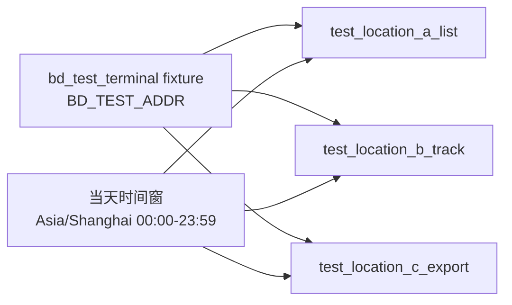

## 范围（3 个接口，全部覆盖）

| # | 方法 | 路径 | YAML 顶层 key | Python 测试方法 |
|---|---|---|---|---|
| 1 | GET | `/api/monitor/locations` | `location_list_cases` | `test_location_a_list` |
| 2 | GET | `/api/monitor/locations/track` | `location_track_cases` | `test_location_b_track` |
| 3 | POST | `/api/monitor/locations/export` | `location_export_cases` | `test_location_c_export` |

## 待新增 / 修改文件

- 新增 `jkpt_api_test/testcases/test_location_controller.py`
- 新增 `jkpt_api_test/yaml/test_location_controller.yaml`
- 不改 `jkpt_api_test/conftest.py`（复用 `auth_headers`、`bd_test_terminal`）

## 数据链路（单文件内 list → track → export）



关键约定：

- **设备地址来源**：`BD_TEST_ADDR`（[`conftest.py`](c:\Users\33606\Desktop\jkpt_api_test\jkpt_api_test\conftest.py) 常量 + `bd_test_terminal` fixture 返回值，约 347 行 `return BD_TEST_ADDR`）。三个测试方法均注入 `bd_test_terminal`，**不**写入、**不**读取 `extract.yaml` 的 `batch_addrs`。
- **时间窗**：`startTimeStr`、`endTimeStr` **不在 YAML 写死**；在 [`test_location_controller.py`](c:\Users\33606\Desktop\jkpt_api_test\jkpt_api_test\testcases\test_location_controller.py) 发请求前按**当前自然日**计算：`{date} 00:00:00` 与 `{date} 23:59:59`，格式与 OpenAPI 一致 `yyyy-MM-dd HH:mm:ss`。时区与导出头 **`Time-Zone: Asia/Shanghai`** 对齐，使用 `zoneinfo.ZoneInfo("Asia/Shanghai")` 取「当天」日期，避免 UTC 与本地跨日偏差。
- pytest 方法名保持 `test_location_a_list` → `test_location_b_track` → `test_location_c_export` 保证收集顺序。
- 负向用例若需「非法时间」可单独传固定字符串或 `scenario` 分支；默认正向/常规负向仍用当天时间窗（addr 为空等负向与日期无关）。

## 关键实现要点

### locations（分页查询位置列表）

- 请求方式：`GET`，参数在 URL query string
- 参数：`addr`（设备地址）、`startTimeStr`（yyyy-MM-dd HH:mm:ss）、`endTimeStr`、`page`、`pageSize`
- 正向：带有效 addr + **当天**时间范围（代码注入）
- 负向：addr 为空、缺 token（`no_auth: true`）；可选单独用例校验非法时间字符串

### locations/track（轨迹查询）

- 请求方式：`GET`，参数在 URL query string
- 参数：`addr`、`startTimeStr`、`endTimeStr`（后两者为当天，代码注入）
- 正向：`addr` 来自 `bd_test_terminal` + 当天时间窗
- 负向：addr 为空等

### locations/export（导出轨迹）

- 请求方式：`POST`，参数在 URL query string，`Time-Zone: Asia/Shanghai` header
- 参数：`addr`、`startTimeStr`、`endTimeStr`（当天，代码注入）
- 正向：`addr` 来自 `bd_test_terminal`；若响应为 JSON 失败体则断言 `expected.code`/`error_msg`；若为二进制则断言 HTTP 200 与非空正文（与 [`test_batch_terminal_controller.py`](c:\Users\33606\Desktop\jkpt_api_test\jkpt_api_test\testcases\test_batch_terminal_controller.py) 中 `_assert_export_response` 行为一致）
- 负向：addr 为空
- 二进制下载：参考 `test_batch_export` 的 `_assert_export_response`，不走 `.json()` 分支

## YAML 结构示例

时间字段由代码统一注入，YAML 中可省略 `startTimeStr`/`endTimeStr`；若保留可读性可加 `use_today_range: true`（无则默认当天）。

```yaml
location_list_cases:
  - name: "分页查询位置列表-正向"
    scenario: "positive"
    addr: "{{bd_test_terminal}}"
    page: 1
    pageSize: 10
    expected: { code: 0, msg: "成功" }
  - name: "分页查询位置列表-负向-addr为空"
    scenario: "empty_addr"
    addr: ""
    expected: { code: 999, error_msg: "失败" }

location_track_cases:
  - name: "获取轨迹信息-正向"
    scenario: "positive"
    addr: "{{bd_test_terminal}}"
    expected: { code: 0, msg: "成功" }
  - name: "获取轨迹信息-负向-addr为空"
    scenario: "empty_addr"
    addr: ""
    expected: { code: 999, error_msg: "无此设备数据信息" }

location_export_cases:
  - name: "导出轨迹信息-正向"
    scenario: "positive"
    addr: "{{bd_test_terminal}}"
    binary_response: true
    expected: { http_status: 200, code: 0, msg: "成功" }
  - name: "导出轨迹信息-负向-addr为空"
    scenario: "empty_addr"
    addr: ""
    expected: { code: 999, error_msg: "失败" }
```

> 表中负向 `code`/`msg` 为某次真实联调示例，**以服务为准**；若与你环境不一致，跑通后改 YAML 即可。

## 实现要点（时间窗）

在 `TestLocationController` 内增加私有方法，例如 `_today_range_shanghai()`，返回 `(start_str, end_str)`：

- `from zoneinfo import ZoneInfo`
- `now = datetime.now(ZoneInfo("Asia/Shanghai")).date()`
- `startTimeStr = f"{now} 00:00:00"`，`endTimeStr = f"{now} 23:59:59"`（注意 `now` 格式化为 `yyyy-MM-dd`）

`_build_location_query_params` 在合并 case 时：若 case 未显式提供 `startTimeStr`/`endTimeStr`，则填入上述当天范围；若某负向用例要测非法时间，可在 YAML 写死两项覆盖默认。

## 用例数预估（每接口 1 正 + 1~2 负向）

- list: 1 正 + 2 负（addr 为空、缺 token）
- track: 1 正 + 1 负（addr 为空）
- export: 1 正 + 1 负（addr 为空）→ 二进制下载断言
- 合计约 8 用例

## Apifox 数据来源（已验证）

通过 `read_project_oas_it1ai0` + `read_project_oas_ref_resources_it1ai0` 读取：

- Tag: `位置管理接口`
- `GET /api/monitor/locations` → `/paths/_api_monitor_locations.json`
- `GET /api/monitor/locations/track` → `/paths/_api_monitor_locations_track.json`
- `POST /api/monitor/locations/export` → `/paths/_api_monitor_locations_export.json`（响应 200 无 schema，预计二进制流）
