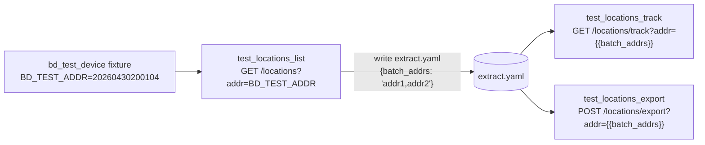

## 范围（3 个接口，全部覆盖）

| # | 方法 | 路径 | YAML 顶层 key | Python 测试方法 |
|---|---|---|---|---|
| 1 | GET | `/api/monitor/locations` | `location_list_cases` | `test_locations_list` |
| 2 | GET | `/api/monitor/locations/track` | `location_track_cases` | `test_locations_track` |
| 3 | POST | `/api/monitor/locations/export` | `location_export_cases` | `test_locations_export` |

## 待新增 / 修改文件

- 新增 `jkpt_api_test/testcases/test_location_controller.py`
- 新增 `jkpt_api_test/yaml/test_location_controller.yaml`
- 不改 `jkpt_api_test/conftest.py`（复用 `auth_headers`、`bd_test_device`）

## 数据链路（单文件内 list → track → export）



关键约定：

- **设备地址来源**：`BD_TEST_ADDR = "20260430200104"`（conftest.py:294 固定值），由 `bd_test_device` fixture 提供。`test_locations_list` 依赖该 fixture 注入 `bd_test_device` 获取设备地址。
- 上游 `test_locations_list` 正向 `code==0` 时，从 `$.data.records[*].addr` 提取后用 `write_yaml("./extract.yaml", {"batch_addrs": ",".join(addrs)}, mode="append")` 写入；类级布尔 `_first_locations_written = False` 控制只写第一次。
- 下游 `test_locations_track` 统一用 `_resolve_value("{{batch_addrs}}", required=True)`；缺失则 `pytest.skip`。
- pytest 默认按文件内方法顺序执行，`test_locations_list` 在前、`test_locations_track` 在后。
- 沿用 `test_batch_terminal_controller.py` 已有的 `_resolve_value` / `_get_variable` / `_assert_and_report` 三个私有方法（同模式复制即可）。

## 关键实现要点

### locations（分页查询位置列表）

- 请求方式：`GET`，参数在 URL query string
- 参数：`addr`（设备地址）、`startTimeStr`（yyyy-MM-dd HH:mm:ss）、`endTimeStr`、`page`、`pageSize`
- 正向：带有效 addr + 时间范围
- 负向：addr 为空、时间范围非法、缺 token（`no_auth: true`）

### locations/track（轨迹查询）

- 请求方式：`GET`，参数在 URL query string
- 参数：`addr`、`startTimeStr`、`endTimeStr`
- 正向：复用 `batch_addrs` + 有效时间范围
- 负向：addr 为空、时间范围非法

### locations/export（导出轨迹）

- 请求方式：`POST`，参数在 URL query string，`Time-Zone: Asia/Shanghai` header
- 参数：`addr`、`startTimeStr`、`endTimeStr`
- 正向：复用 `batch_addrs` + 有效时间范围；断言 HTTP 200 + 二进制内容非空
- 负向：addr 为空
- 二进制下载：参考 `test_batch_export` 的 `_assert_export_response`，不走 `.json()` 分支

## YAML 结构示例

```yaml
location_list_cases:
  - name: "分页查询位置列表-正向"
    addr: "20260430200104"
    startTimeStr: "2026-05-01 00:00:00"
    endTimeStr: "2026-05-07 23:59:59"
    page: 1
    pageSize: 10
    expected: { code: 0, error_msg: "成功" }
  - name: "分页查询位置列表-负向-addr为空"
    addr: ""
    startTimeStr: "2026-05-01 00:00:00"
    endTimeStr: "2026-05-07 23:59:59"
    expected: { code: 1001, error_msg: "设备地址不能为空" }

location_track_cases:
  - name: "获取轨迹信息-正向"
    addr: "{{batch_addrs}}"
    startTimeStr: "2026-05-01 00:00:00"
    endTimeStr: "2026-05-07 23:59:59"
    expected: { code: 0, error_msg: "成功" }
  - name: "获取轨迹信息-负向-addr为空"
    addr: ""
    startTimeStr: "2026-05-01 00:00:00"
    endTimeStr: "2026-05-07 23:59:59"
    expected: { code: 1001, error_msg: "设备地址不能为空" }

location_export_cases:
  - name: "导出轨迹信息-正向"
    addr: "{{batch_addrs}}"
    startTimeStr: "2026-05-01 00:00:00"
    endTimeStr: "2026-05-07 23:59:59"
    binary_response: true
    expected: { http_status: 200 }
  - name: "导出轨迹信息-负向-addr为空"
    addr: ""
    startTimeStr: "2026-05-01 00:00:00"
    endTimeStr: "2026-05-07 23:59:59"
    expected: { code: 1001, error_msg: "设备地址不能为空" }
```

> 实际错误码 / 错误文案以服务返回为准，首次跑通后回填。

## 用例数预估（每接口 1 正 + 1~2 负向）

- list: 1 正 + 2 负（addr 为空、缺 token）
- track: 1 正 + 1 负（addr 为空）
- export: 1 正 + 1 负（addr 为空）→ 二进制下载断言
- 合计约 8 用例

## Apifox 数据来源（已验证）

通过 `read_project_oas_it1ai0` + `read_project_oas_ref_resources_it1ai0` 读取：

- Tag: `位置管理接口`
- `GET /api/monitor/locations` → `/paths/_api_monitor_locations.json`
- `GET /api/monitor/locations/track` → `/paths/_api_monitor_locations_track.json`
- `POST /api/monitor/locations/export` → `/paths/_api_monitor_locations_export.json`（响应 200 无 schema，预计二进制流）
