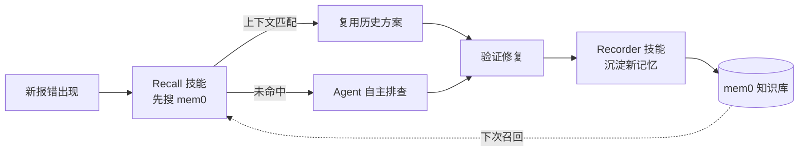

# mem0 Bugfix 记忆技能包落地计划

## 概述

在 `jkpt_api_test/.cursor/rules/` 新增 3 个文件，形成「写入—召回」闭环：



---

## 项目适配说明

Notion 原文面向 Java 后端项目，本次落地需适配 `jkpt_api_test` 的 Python API 测试技术栈：

| 原文 | 适配后 |
|------|--------|
| `project: pg-podium-monitor` | `project: jkpt_api_test` |
| `stack: java/redis/vue3` | `stack: python/pytest/requests/yaml` |
| `module: enclosure/sos/...` | `module: conftest/protocol_codec/terminal_controller/batch_terminal/bd_protocol/export_assert` |
| `category: api_failure/build_failure/...` | `category: api_failure/test_failure/fixture_failure/assertion_failure/env_failure/config_failure` |
| `error_signature: ExceptionClass@ClassName.method` | `error_signature: ExceptionClass@module.function 或 error_keyword@/api/path` |

---

## 新增文件（3 个）

### 1. `mem0-bugfix-schema.md` — 共享 Schema

路径：`jkpt_api_test/.cursor/rules/mem0-bugfix-schema.md`

记忆正文 7 段式模板（每段一行，便于向量切分）：

```
[场景] 在 <模块/接口/fixture> 中出现 <报错关键词>。
[触发条件] 当 <前置条件/参数/环境> 时发生。
[根因] 真实原因是 <一句话根因>，背后机制是 <机制说明>。
[排查路径] 关键定位手段：<日志关键字/工具/复现命令>。
[修复方案] 推荐做法：<修复>；次选：<备选>。
[验证方式] 通过 <验证步骤/pytest 用例> 确认已修复。
[反模式] 不要 <常见错误修法，会导致 X>。
```

元数据 JSON Schema（适配本项目）：

```json
{
  "type": "bugfix",
  "category": "api_failure | test_failure | fixture_failure | assertion_failure | env_failure | config_failure",
  "project": "jkpt_api_test",
  "module": "conftest | protocol_codec | protocol_transport | terminal_controller | batch_terminal | bd_protocol | export_assert",
  "stack": ["python", "pytest", "requests", "yaml"],
  "error_signature": "<ExceptionClass>@<module.function> 或 <error_keyword>@</api/path>",
  "severity": "P0|P1|P2|P3",
  "tags": [],
  "source": "cursor-agent",
  "verified": true,
  "parent_id": null
}
```

`error_signature` 是去重主键：同签名走 `update_memory`，不同走 `add_memory`。

注意：官方 `search_memories` 返回结构可能是文本化 `result`，不保证稳定暴露结构化 `score`。执行去重时以“结果中明确包含相同 `error_signature` 且能拿到 `memory_id`”为准；否则默认新增 `add_memory`，避免误覆盖历史记忆。

---

### 2. `mem0-bugfix-recorder.mdc` — Recorder 写入技能

路径：`jkpt_api_test/.cursor/rules/mem0-bugfix-recorder.mdc`

- `alwaysApply: false`（手动触发或排障闭环结束自动触发）
- 触发词：`记一下 / 复盘 / 写进 mem0 / sync memory`
- 执行步骤：抽取 JSON → 去重检索（`search_memories`）→ 路由（add/update）→ 渲染 7 段正文 → 写入 → 回执一行
- 去重检索参数：

```json
{
  "query": "<error_signature> <module>",
  "filters": {
    "AND": [
      {"user_id": "tongmeina"},
      {"type": "bugfix"},
      {"project": "jkpt_api_test"}
    ]
  },
  "top_k": 5,
  "source": "cursor-agent"
}
```

- 路由规则：
  - 若检索结果明确包含相同 `error_signature` 且返回 `memory_id`：调用 `update_memory(memory_id, text)`
  - 否则：调用 `add_memory(text, user_id="tongmeina", metadata=...)`

---

### 3. `mem0-bugfix-recall.mdc` — Recall 召回技能

路径：`jkpt_api_test/.cursor/rules/mem0-bugfix-recall.mdc`

- `alwaysApply: false`（报错场景自动激活）
- 触发条件：用户粘贴报错堆栈 / pytest 失败日志 / 接口 5xx 返回
- 执行步骤：提取 `error_signature` + `module` → 两轮检索（精确 + 语义）→ 命中则输出摘要 → 未命中则自主排查 → 场景一致性校验
- 两轮检索参数：

```json
{
  "query": "<error_signature>",
  "filters": {
    "AND": [
      {"user_id": "tongmeina"},
      {"type": "bugfix"},
      {"project": "jkpt_api_test"},
      {"module": "<module>"}
    ]
  },
  "top_k": 5,
  "source": "cursor-agent"
}
```

若精确检索结果不足，再用用户原始报错文本做语义检索。命中判断不强依赖 score；以是否包含相同接口路径、异常类、错误关键词、模块上下文为准。

---

## 与现有项目的协同

- mem0 MCP 已切换为官方云端 `streamable-http`，3 个 rules 文件即可直接使用
- 当前官方 mem0 MCP 工具名为 `add_memory`、`search_memories`、`update_memory`，计划中不得继续使用旧本地脚本的 `search_memory`
- `search_memories` 参数使用 `query`、`filters`、`top_k`，不再使用旧参数 `limit`
- 当前已有 `caveman.mdc`、`jkpt-api-test.mdc`、`plan-path.mdc`，3 个新文件与其并列，互不干扰
- 未来可扩展：`error_signature` 与禅道 bug ID 联动（禅道 MCP 已接入）

---

## 后续可扩展（Notion 原文建议，暂不在本次范围）

- 周报自动汇总：定期 search `type=bugfix, severity in [P0,P1]`，输出高频缺陷 Top10
- 禅道双向联动：`error_signature` 作为禅道 bug 外部 ID
- 团队共享：mem0 user_id 切换为团队共享 ID
