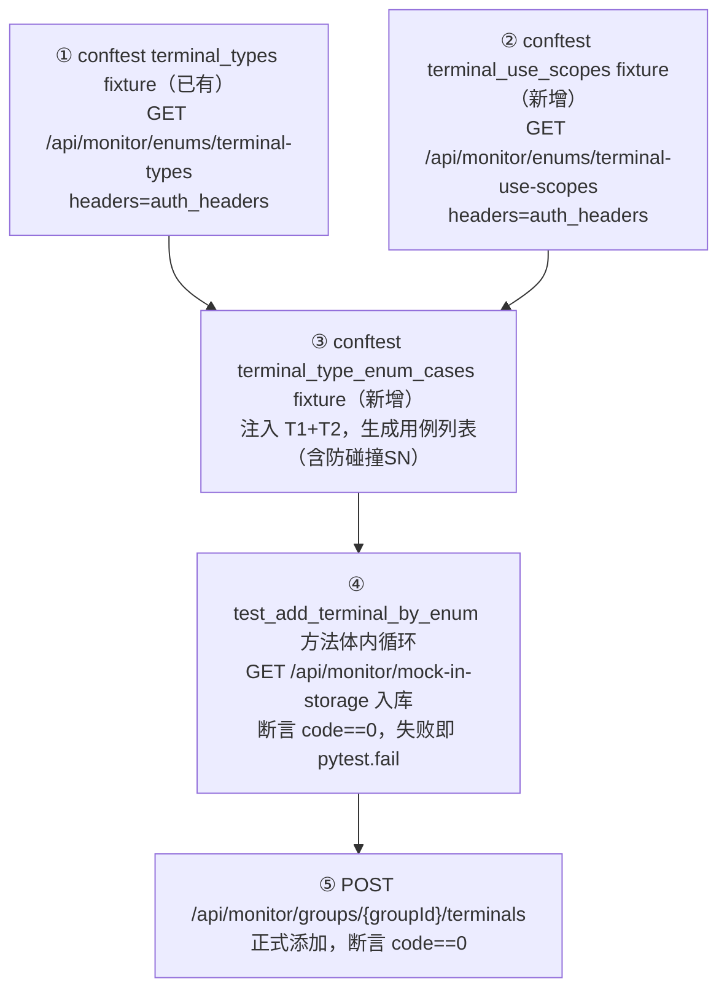

# 设备添加正向用例扩展：枚举类型 x 入库 x 添加

## 数据链路



## 接口参数详情（已通过 apifox-jkpt MCP 确认）

### 接口① GET /api/monitor/enums/terminal-types（已有 fixture，无需重复）

conftest.py 第 262–291 行已存在 `terminal_types` fixture（scope="session"），直接注入复用，**禁止**在新 fixture 中重复调用该接口。

响应 data 数组元素：

```json
{"name": "PN07", "value": "4G北斗智能定位设备"}
{"name": "PD22", "value": "北三车载"}
```

约 13 种类型（实际数量运行时确认）。

### 接口② GET /api/monitor/enums/terminal-use-scopes（新增 fixture）

| 参数 | 位置 | 必填 | 值 |
|------|------|------|-----|
| Authorization | header | 是 | auth_headers（同 terminal_types，用 headers= 传递） |

响应格式同①，元素为 `{name, value}`。

### 接口③ GET /api/monitor/mock-in-storage（终端入库）

| 参数 | 位置 | 必填 | 来源 | 示例 |
|------|------|------|------|------|
| Authorization | query | 是 | auth_headers["Authorization"] | Bearer xxx |
| addr | query | 是 | 防碰撞SN | 202605190001001 |
| sn | query | 是 | 同 addr | 202605190001001 |
| name | query | 是 | terminalType 的 value | 4G北斗智能定位设备 |
| remark | query | 是 | terminalType 的 value | 4G北斗智能定位设备 |
| terminalType | query | 是 | 接口①的 name | PN07 |
| useScope | query | 是 | 接口②的 name | ANIMAL |

> 注：Authorization 此接口为 query 参数（该接口特殊，与其他接口用 header 不同）。

> 入库失败（code != 0）：调用 `pytest.fail()` 中断当前迭代，不继续执行添加接口。

### 接口④ POST /api/monitor/groups/{groupId}/terminals（正式添加）

| 参数 | 位置 | 必填 | 来源 |
|------|------|------|------|
| groupId | path | 是 | group_fixture["three_id"] |
| addr | body | 是 | 空字符串（服务端自动生成） |
| sn | body | 是 | 入库时的 SN |
| terminalType | body | 是 | 接口①的 name |
| useScope | body | 是 | 接口②的 name |
| remark | body | 是 | 接口①的 value |
| password | body | 是 | 空字符串（固定） |
| trackColor | body | 否 | `#141323`（固定，同 [test_terminal_controller.yaml](jkpt_api_test/yaml/test_terminal_controller.yaml) L13） |
| trackSize | body | 否 | `5`（固定，同 L14） |
| gatewayParam | body | 否 | 同 YAML L15-23（见下） |
| fieldJson | body | 否 | `""`（固定，同 L24） |
| fields | body | 否 | 同 YAML L25-29（见下） |

与 `yaml/test_terminal_controller.yaml` 第 15-29 行逐字一致（接口④固定体）：

```yaml
gatewayParam:
  colorCodeId: 1
  gid: 0
  radioRcvChn: ""
  radioSndChn: ""
  radioPower: 0
  rxCss: ""
  txCss: ""
  width: 0
fieldJson: ""
fields:
  - name: "自定义字段1"
    value: "自定义值1"
  - name: "自定义字段2"
    value: "自定义值2"
```

---

## SN 生成规则（防碰撞）

格式：`{日期}{分钟戳后4位}{序号3位}`，如 `202605190001001`

- 日期前缀：`datetime.datetime.now().strftime("%Y%m%d")`
- 防碰撞中缀：`str(int(time.time()) % 10000).zfill(4)`（当天分钟级时间戳后4位）
- 序号后缀：`{i:03d}`，从 1 开始
- 例：当天第1次运行约 `202605190001001`，第2次运行约 `202605190012001`（中缀不同）

> 目的：同一天多次运行不碰撞，无需手动清理历史 SN。

---

## 实现方案

### Step 1：conftest.py 新增 `terminal_use_scopes` fixture

```python
@pytest.fixture(scope="session")
def terminal_use_scopes(base_url, auth_headers):
    """获取所有使用范围枚举，session级别只调用一次"""
    sep(" 📋 获取使用范围枚举 ")
    url = f"{base_url}/api/monitor/enums/terminal-use-scopes"
    resp = http.send_request(
        method="get",
        url=url,
        headers=auth_headers,
        case_name="获取使用范围枚举",
        log_level="none",
    )
    json_data = resp.json()
    code = _jsonpath_parse(json_data, "$.code")[0]
    if code == 0:
        scopes = _jsonpath_parse(json_data, "$.data[*]")
        if scopes:
            key("使用范围列表", scopes)
            return scopes
        key("使用范围列表", "未获取到")
        return []
    msg = _jsonpath_parse(json_data, "$.msg")[0]
    key("获取使用范围失败", f"code={code}, msg={msg}")
    return []
```

### Step 2：conftest.py 新增 `terminal_type_enum_cases` fixture

注入已有 `terminal_types` + 新增 `terminal_use_scopes`，生成用例列表：

```python
@pytest.fixture(scope="session")
def terminal_type_enum_cases(terminal_types, terminal_use_scopes):
    """生成 N 条枚举用例（useScope 循环选取，SN 防碰撞）"""
    import time as _time
    if not terminal_types or not terminal_use_scopes:
        pytest.skip("terminal_types 或 terminal_use_scopes 为空，跳过枚举用例")
    base_sn = datetime.datetime.now().strftime("%Y%m%d")
    salt = str(int(_time.time()) % 10000).zfill(4)
    cases = []
    for i, t in enumerate(terminal_types, start=1):
        scope = terminal_use_scopes[i % len(terminal_use_scopes)]
        sn = f"{base_sn}{salt}{i:03d}"
        cases.append({
            "sn": sn,
            "terminalType": t["name"],
            "remark": t["value"],
            "useScope": scope["name"],
        })
    key("枚举用例数量", len(cases))
    return cases
```

> `datetime` 已在 conftest.py 顶部按需引入（或直接 `import datetime`）。

### Step 3：`test_terminal_controller.py` 新增测试方法

**不使用 `@pytest.mark.parametrize`**，注入 fixture 后方法体内循环：

```python
def test_add_terminal_by_enum(self, base_url, auth_headers, group_fixture, terminal_type_enum_cases):
    """每种 terminalType 入库 -> 正式添加（循环遍历枚举用例）"""
    group_id = group_fixture["three_id"]
    auth = auth_headers["Authorization"]

    for case in terminal_type_enum_cases:
        # ① 入库
        sep(f" 入库: {case['terminalType']} SN={case['sn']}")
        r_storage = http.send_request(
            "get",
            f"{base_url}/api/monitor/mock-in-storage",
            params={
                "Authorization": auth,
                "addr": case["sn"],
                "sn": case["sn"],
                "name": case["remark"],
                "remark": case["remark"],
                "terminalType": case["terminalType"],
                "useScope": case["useScope"],
            },
            log_level="none",
        )
        print_response(r_storage)
        storage_json = r_storage.json()
        storage_code = _jsonpath_parse(storage_json, "$.code")[0]
        if storage_code != 0:
            storage_msg = _jsonpath_parse(storage_json, "$.msg")[0]
            pytest.fail(f"入库失败 [{case['terminalType']} SN={case['sn']}]: code={storage_code}, msg={storage_msg}")

        # ② 正式添加
        sep(f" 添加: {case['terminalType']} SN={case['sn']}")
        r_add = http.send_request(
            "post",
            f"{base_url}/api/monitor/groups/{group_id}/terminals",
            json={
                "addr": "",
                "remark": case["remark"],
                "useScope": case["useScope"],
                "sn": case["sn"],
                "password": "",
                "terminalType": case["terminalType"],
                "trackColor": "#141323",
                "trackSize": 5,
                "gatewayParam": {
                    "colorCodeId": 1,
                    "gid": 0,
                    "radioRcvChn": "",
                    "radioSndChn": "",
                    "radioPower": 0,
                    "rxCss": "",
                    "txCss": "",
                    "width": 0,
                },
                "fieldJson": "",
                "fields": [
                    {"name": "自定义字段1", "value": "自定义值1"},
                    {"name": "自定义字段2", "value": "自定义值2"},
                ],
            },
            headers={**auth_headers, "Content-Type": "application/json"},
            case_name=f"枚举添加-{case['terminalType']}",
            log_level="none",
        )
        print_response(r_add)
        self._assert_and_report_res(r_add, f"枚举添加-{case['terminalType']}")
```

### Step 4：`test_terminal_controller.py` 新增辅助方法 `_assert_and_report_res`

接受 Response 对象，内部提取 code/msg，避免与现有 `_assert_and_report(case, res)` 签名混淆：

```python
def _assert_and_report_res(self, res, case_name):
    """接受 Response 对象的断言（枚举用例无 YAML expected）"""
    json_data = res.json()
    code = _jsonpath_parse(json_data, "$.code")[0]
    msg = _jsonpath_parse(json_data, "$.msg")[0]
    sep(" 断言结果 ")
    key("实际 code", code)
    key("实际 msg", msg)
    assert_api_result(
        case_name=case_name,
        expected_code=0,
        expected_msg="成功",
        actual_code=code,
        actual_msg=msg,
    )
```

---

## 涉及文件

| 文件 | 操作 |
|------|------|
| `conftest.py` | 新增 `terminal_use_scopes` fixture |
| `conftest.py` | 新增 `terminal_type_enum_cases` fixture（注入 terminal_types + terminal_use_scopes） |
| `testcases/test_terminal_controller.py` | 新增 `test_add_terminal_by_enum` 方法（方法体循环，不用 parametrize） |
| `testcases/test_terminal_controller.py` | 新增 `_assert_and_report_res` 辅助方法 |

---

## 已关闭待确认事项

| # | 问题 | 结论 |
|---|------|------|
| 1 | terminal-use-scopes 枚举值数量 | 运行时由 `terminal_use_scopes` fixture 动态获取，循环选取，无需预先确认 |
| 2 | 入库失败策略 | 入库失败调用 `pytest.fail()` 中断当前迭代，不继续执行添加 |
| 3 | 设备清理 | 现有 `cleanup_test_data` 按分组全量清理，three_id 下新增设备自动覆盖，**无需单独处理** |

## 框架合规检查

| 检查项 | 状态 |
|--------|------|
| HTTP 入口使用 `BaseRequest` | ✅ |
| jsonpath 使用 `_jsonpath_parse = jsonpath.jsonpath` | ✅ |
| 断言使用 `assert_api_result` | ✅ |
| 不使用 `import jsonpath as _jp` | ✅（已移除） |
| 不用 fixture 作为 parametrize 数据源 | ✅（改为方法体循环） |
| terminal_types 不重复调用 | ✅（直接注入复用） |
| 认证头接口①②用 `headers=auth_headers` | ✅ |
| 认证头接口③（mock-in-storage）用 query params | ✅（该接口特殊） |
| SN 防碰撞 | ✅（加时间戳盐值） |
